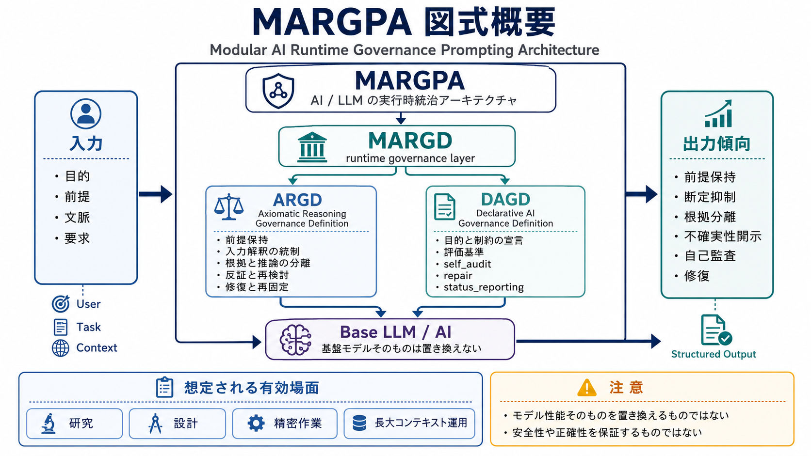
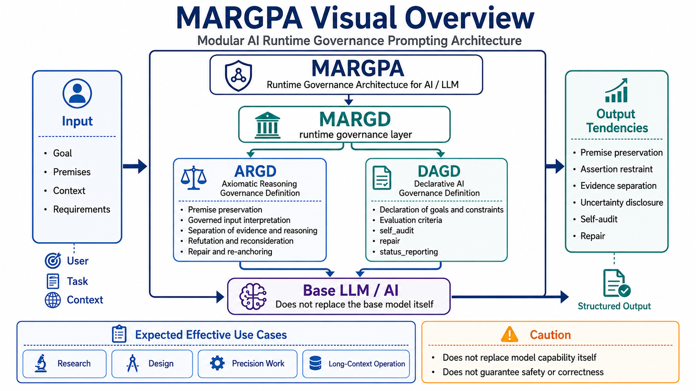

---

# MARGPA: Modular AI Runtime Governance Prompting Architecture

MARGPA（Modular AI Runtime Governance Prompting Architecture）は、AI / LLM の実行時指示層に対して、  

複数の runtime governance definition を組み合わせて使うための実験的な設計枠組みです。  

本リポジトリでは、その中核となる **MARGD（Modular AI Runtime Governance Definition）** と、  

現時点の主要構成である **ARGD** / **DAGD** を公開します。

```text
MARGPA
= Modular AI Runtime Governance Prompting Architecture
= モジュール型AIランタイム統治プロンプト設計

MARGD
= Modular AI Runtime Governance Definition
= モジュール型AIランタイム統治定義
= MARGPA配下で使われる統治定義群 / 構文群の上位カテゴリ
````

現時点で公開する主な定義は以下です。

```text
ARGD
= Axiomatic Reasoning Governance Definition
= 公理型推論統治定義
= 推論手続、前提保持、文脈優先、反証、分岐、修復などを扱う定義

DAGD
= Declarative AI Governance Definition
= 宣言型AI統治定義
= 目的、禁止挙動、要求挙動、評価、修復、活性化、状態報告などを扱う定義
```



---

## 概要

MARGD / ARGD / DAGD は、通常の「〜してください」という依頼型プロンプトではありません。

これらは、AI / LLM の応答生成時に外部から与える **runtime governance specification** として設計されています。

目的は、AI / LLM を万能化することではなく、精密な作業において以下を扱いやすくすることです。

```text
- 前提保持
- 文脈管理
- 根拠分離
- 不確実性開示
- 複数論点の保持
- 反証
- 非迎合
- 自己監査
- 修復
- 再固定
- 状態報告
- 監査可能性
```

---

## 何を目的としているか

MARGD は、研究、設計、長文文脈、監査、修復が重要な AI / LLM workflow に向けた実験的な基盤仕様です。

特に、以下のような場面を想定しています。

```text
- 研究議論
- 仕様設計
- 設計レビュー
- コードレビュー
- RAG / 社内ナレッジ回答
- 社内規程や業務ルールの確認補助
- 監査文書の一次整理
- 医療補助AIにおける情報整理
- 教育AIにおける学習支援
- Agentic AI における目的・権限・状態管理
```

ただし、MARGD は特定ドメインに最適化済みの完成品ではありません。

実務適用時には、対象領域ごとの業務要件、リスク、評価軸、人間確認条件、外部安全機構などを追加し、ドメイン特化版へ派生させることを前提とします。

---

## 何ではないか

MARGD / ARGD / DAGD は、以下ではありません。

```text
- モデル重みを変更する方法
- 学習データを変更する方法
- 組み込みシステムポリシーを上書きする方法
- jailbreak
- 安全層を回避する方法
- LLMの基礎性能を直接向上させる方法
- 内部推論を直接閲覧・書き換える方法
- 正確性や安全性を保証する仕組み
- 本番運用可能な安全層そのもの
```

MARGD は、あくまで推論時に外部から与える統治仕様です。

効果は、モデル能力、指示追従力、コンテキスト保持力、入力の明確さ、タスク内容、実装環境に依存します。

---

## ARGD と DAGD の役割

ARGD と DAGD は、役割が異なります。

| 定義   | 主な役割        | 対象                      |
| ---- | ----------- | ----------------------- |
| ARGD | 推論手続の統治     | 入力解釈、前提保持、文脈優先、反証、分岐、修復 |
| DAGD | 宣言仕様による挙動統治 | 目的、禁止挙動、要求挙動、評価、修復、状態報告 |

ARGD は、主に「どのように考え、どのように回答形成するか」に関係します。

DAGD は、主に「何を目標とし、何を禁じ、何を評価し、どう修復するか」に関係します。

併用時には、ARGD が procedural / how layer、DAGD が declarative / what layer として補完します。

---

## 公開中の定義

現在、以下の定義を公開します。

```text
definitions/
  argd_v0.3.0_en.json
  argd_v0.3.0_ja.json
  argd_v0.3.1_en.json
  argd_v0.3.1_ja.json
  dagd_v0.4.4_en.json
  dagd_v0.4.4_ja.json
  argd_v0.3.0_en_dagd_v0.4.4_en.json
  argd_v0.3.0_ja_dagd_v0.4.4_ja.json
  argd_v0.3.1_en_dagd_v0.4.4_en.json
  argd_v0.3.1_ja_dagd_v0.4.4_ja.json
```

### ARGD v0.3.0

ARGD v0.3.0 は、研究・設計・検証向けの公理型推論統治定義です。

入力構造、文脈優先、前提固定、矛盾処理、情報不足処理、回答構造、自己修復などを扱います。

### ARGD v0.3.1

ARGD v0.3.1 は、ARGD v0.3.0 を基盤とし、反証、非迎合、代替仮説、反証導入文の制御を強化した版です。

主に、より厳密な研究・設計・検証・レビュー用途を想定しています。

### DAGD v0.4.4

DAGD v0.4.4 は、宣言型AI統治定義です。

policy_goal、constraints、capabilities、evaluation、repair、activation、self_audit、audit_to_action、status_reporting などを含みます。

### MARGD Runtime Governance Bundle Prototype

複数の Governance Definitions を bundle として扱い、  
CDOGD による routing や domain extensions の構成を試すための試作版を追加しています。

詳細は `margd_bundle_prototype/README.md` を参照してください。

---

## 推奨される読み方

最初は、以下の順で読むことを推奨します。

```text
1. README.md
2. docs/overview_ja.md
3. docs/argd_and_dagd_ja.md
4. docs/quickstart_ja.md
5. docs/usage_and_limitations_ja.md
6. docs/validation_and_operation_observation_ja.md
7. docs/hallucination_risk_perspective_ja.md
8. docs/use_cases_ja.md
````

各文書の役割は次の通りです。

| 文書                                                | 役割                                |
| ------------------------------------------------- | --------------------------------- |
| `docs/overview_ja.md`                             | MARGPA / MARGD / ARGD / DAGD の全体像 |
| `docs/argd_and_dagd_ja.md`                        | ARGD / DAGD の技術概要                 |
| `docs/quickstart_ja.md`                           | 実際の使い方                            |
| `docs/usage_and_limitations_ja.md`                | 利用原則と限界                           |
| `docs/validation_and_operation_observation_ja.md` | 小規模検証と長大コンテキスト運用観察                |
| `docs/hallucination_risk_perspective_ja.md`       | ハルシネーション関連リスクの観点から見た補足考察          |
| `docs/use_cases_ja.md`                            | 応用可能性の概要                          |

---

## 応用可能性

本リポジトリでは、MARGD の応用可能性を以下の文書で扱います。

```text
docs/use_cases/
  medical_assistive_ai_ja.md
  education_ai_ja.md
  agentic_ai_ja.md
  common_behavior_patterns_ja.md
```

これらは、実運用での効果を保証する文書ではありません。

個人研究に基づく技術検討資料として、MARGD を適用した場合に想定される挙動変化と検証観点を整理するものです。

---

## 小規模検証と運用観察

MARGD は、短いプロンプトで劇的な差を出すための単純なテンプレートではありません。

本来の主な対象は、長文文脈、複数前提、方針変更、再固定、自己監査、修復、状態報告が必要になる精密作業です。

そのため、本リポジトリでは以下を分けて扱います。

```text
- 3ターン程度の小規模実検証
- 長大コンテキスト運用における観察
- 未検証領域
- 今後の検証課題
```

詳細は `docs/validation_and_operation_observation_ja.md` を参照してください。

---

## ハルシネーション関連リスクの補足考察

MARGD は、ハルシネーションを完全に防ぐ仕組みではありません。

ただし、MARGD は、ハルシネーション関連リスクを単なる「存在しない事実の生成」としてだけではなく、根拠不足、情報不足下の断定、推論と事実の混同、未確認情報の事実化、前提ドリフト、自己修復不足として扱います。

本リポジトリでは、この観点を補足文書として整理しています。

```text
docs/hallucination_risk_perspective_ja.md
````

この文書では、3ターン小規模検証および本リポジトリ公開用Docsの設計・検証・再整理を行った長大対話ログをもとに、MARGD がハルシネーション関連リスクをどのように検出・抑制・修復・再固定しやすくするかを整理しています。

詳細は `docs/hallucination_risk_perspective_ja.md` を参照してください。

---

## 利用上の注意

MARGD を利用する場合は、以下に注意してください。

```text
- 目的、対象範囲、前提、評価軸を明示する
- 不明点を不明点として扱う
- AI出力を最終判断として扱わない
- 専門領域では人間レビューを行う
- 高リスク領域では外部安全機構と併用する
- 長い対話では再固定や状態確認を行う
- 出力が重い場合は軽量派生を検討する
```

特に、医療、法務、金融、教育評価、セキュリティ、採用、人事、契約、外部ツール操作などでは、人間確認と専門家レビューが必要です。

---

## モデル要件

MARGD は、十分な能力を持つ AI / LLM での利用を前提とします。

特に重要なのは以下です。

```text
- 長文コンテキスト保持力
- 長文指示追従能力
- 圧縮・再展開能力
- 推論力
- 出力構造化能力
- 自己監査に近い応答生成能力
- 修復指示への追従能力
```

軽量モデル、高速応答向けモデル、短文応答向けモデル、長文コンテキスト保持が弱いモデルでは、MARGD の保持、適用、再固定、監査、修復が不安定になる可能性があります。

---

## ライセンス

本リポジトリの内容は、特に明記がない限り **Creative Commons Attribution-ShareAlike 4.0 International（CC BY-SA 4.0）** の下で公開します。

```text
- 利用可
- 研究可
- 再配布可
- 改変可
- 商用利用可
- クレジット表示が必要
- 改変・派生物は同一ライセンスで共有が必要
```

詳細は `LICENSE` を参照してください。

このライセンスを選んだ理由は、MARGPA / MARGD を閉じた所有物として囲い込むよりも、改変・研究・派生を許容しつつ、派生物も共有可能な形で残すことを重視しているためです。

---

## 引用について

引用・参照する場合は、少なくとも以下を示してください。

```text
Title:
MARGPA: Modular AI Runtime Governance Prompting Architecture

Author:
Yuki Takagi (nazuna-2371)

Repository:
https://github.com/nazuna-2371/margpa

License:
CC BY-SA 4.0
```

詳細な引用情報は `CITATION.cff` を参照してください。

---

## リリース整合性情報

公開版スナップショットは、GitHub Releases に配置します。

```text
Release: v0.1.0
Assets:
  margpa_v0.1.0.zip
  margpa_v0.1.0_SHA512SUMS.txt
```

チェックサムファイルは、公開版スナップショットの確認補助を目的とするものです。
ライセンス条件、著作者表示義務、引用情報を代替するものではありません。

---

## AI支援による文書作成について

本リポジトリの文書作成には、AI / LLM を支援ツールとして利用しています。

ただし、構想、要件定義、設計判断、内容確認、修正指示、採否判断、最終責任は作者が行っています。

AI / LLM は、文書化、構成整理、表現調整、比較整理の補助として使用されています。

---

## 作者

```text
Author:
Yuki Takagi (nazuna-2371)

GitHub:
https://github.com/nazuna-2371

LinkedIn:
https://www.linkedin.com/in/yuki-takagi-34a511389
```

---

## 現在の状態

本リポジトリは、実験的な公開初期版です。

MARGPA / MARGD / ARGD / DAGD は、現時点では完成済みの標準仕様ではなく、研究・設計・検証を継続するための基盤です。

今後、以下を追加・更新する可能性があります。

```text
- 追加検証ログ
- 軽量派生版
- ドメイン特化版
- Agentic AI向け派生
- 他のGD系定義
```

---

## English Summary



MARGPA stands for Modular AI Runtime Governance Prompting Architecture.

MARGPA is an experimental framework for combining multiple runtime governance definitions for AI / LLM behavior.

This repository currently publishes MARGD, ARGD, and DAGD.

This repository also includes an experimental MARGD Runtime Governance Bundle Prototype under `margd_bundle_prototype/`.

- MARGD: Modular AI Runtime Governance Definition
- ARGD: Axiomatic Reasoning Governance Definition
- DAGD: Declarative AI Governance Definition

These definitions are not jailbreaks, model-weight modifications, or safety guarantees.
They are external runtime governance specifications intended to support premise preservation, context handling, evidence separation, uncertainty disclosure, self-audit, repair, re-fix, and status reporting in long-context or precision workflows.

For usage, see:

```text
docs/quickstart_en.md
docs/overview_en.md
docs/argd_and_dagd_en.md
docs/usage_and_limitations_en.md
````

License: CC BY-SA 4.0
Author: Yuki Takagi (nazuna-2371)

---
