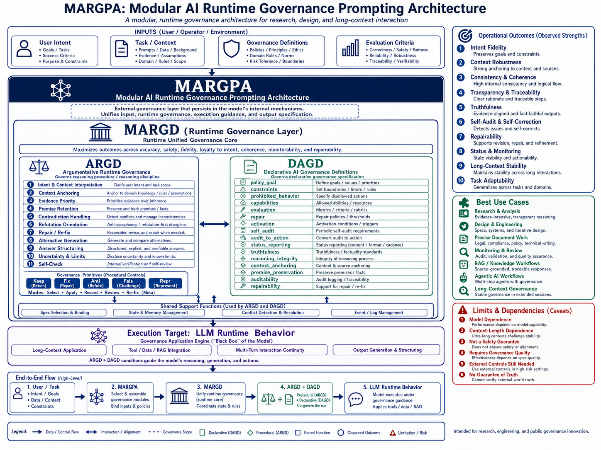

---

# Technical Overview of ARGD and DAGD

---

## 1. Positioning of This Document

This document is a technical overview explaining the roles, structures, combined use, intended applications, and limitations of ARGD and DAGD, the main components of the MARGD family.

This document is not the full reference for ARGD / DAGD.
For the full definitions, refer to the following JSON files.

```text
definitions/
  argd_v0.3.0_en.json
  argd_v0.3.0_ja.json
  argd_v0.3.1_en.json
  argd_v0.3.1_ja.json
  dagd_v0.4.4_en.json
  dagd_v0.4.4_ja.json
  argd_v0.3.0_en_dagd_v0.4.4_en.json
  argd_v0.3.0_ja_dagd_v0.4.4_ja.json
  argd_v0.3.1_en_dagd_v0.4.4_en.json
  argd_v0.3.1_ja_dagd_v0.4.4_ja.json
```

The purpose of this document is to help first-time readers of ARGD / DAGD understand the following.

* What ARGD governs
* What DAGD governs
* Why the two exist separately
* What they complement when used together
* What kinds of use cases they are suited for
* What limitations they have

---

## 2. Basic Terms

### 2.1 MARGD

MARGD stands for Modular AI Runtime Governance Definition.

MARGD is not a single definition. It is a family name for runtime governance definitions that may include ARGD, DAGD, and future additional definitions.

```text
MARGD
= Modular AI Runtime Governance Definition
= Upper-level category for governance definitions / syntax families used under MARGPA
```

### 2.2 ARGD

ARGD stands for Axiomatic Reasoning Governance Definition.

ARGD is a runtime governance definition that handles AI / LLM reasoning procedures, input interpretation, context priority, premise fixation, contradiction handling, handling of insufficient information, refutation, branching, answer structure, expression control, and self-repair.

```text
ARGD
= Axiomatic Reasoning Governance Definition
= Runtime governance definition for governing reasoning procedures
```

ARGD also has the informal name Dialogue Axiom.

### 2.3 DAGD

DAGD stands for Declarative AI Governance Definition.

DAGD is a runtime governance definition that handles AI / LLM goals, prohibited behaviors, required behaviors, capability requirements, evaluation, repair, activation, self-audit, audit-to-action handling, and status reporting.

```text
DAGD
= Declarative AI Governance Definition
= Declarative governance definition for behavior, constraints, evaluation, repair, auditing, re-binding, and related controls
```

### 2.4 runtime governance specification

In this repository, runtime governance specification refers to a governance specification supplied externally at AI / LLM runtime.

It does not modify model weights, training data, or built-in safety layers.

It also does not directly inspect or rewrite the AI / LLM’s internal reasoning.

The target is observable response-generation behavior.



---

## 3. Shortest Comparison Between ARGD and DAGD

ARGD and DAGD are not syntax definitions with the same role.

The shortest distinction is as follows.

| Item           | ARGD                                                                                             | DAGD                                                                                       |
| -------------- | ------------------------------------------------------------------------------------------------ | ------------------------------------------------------------------------------------------ |
| Main target    | Reasoning procedures                                                                             | Declarative specification / behavior governance                                            |
| Main role      | Governs how to interpret, reason, and answer                                                     | Defines what to aim for, what to prohibit, what to require, and how to evaluate and repair |
| Closest layer  | procedural / how layer                                                                           | declarative / what layer                                                                   |
| Main objects   | Input interpretation, premise fixation, branching, refutation, answer structure, self-repair     | Goals, prohibitions, required behaviors, evaluation, repair, activation, status reporting  |
| Strengths      | Context preservation, premise preservation, refutation, branch preservation, logical consistency | Policy fixation, behavioral constraints, auditing, repair, re-binding, status reporting    |
| Standalone use | Possible                                                                                         | Possible                                                                                   |
| Combined use   | ARGD supports DAGD goals and constraints from the reasoning-procedure side                       | DAGD gives goals, evaluation, and repair conditions to ARGD reasoning procedures           |

In simplified form:

```text
ARGD:
How to think, preserve, branch, and construct answers

DAGD:
What to aim for, what to avoid, what to evaluate, and how to repair
```

---

## 4. Role of ARGD

ARGD is a definition for governing AI / LLM reasoning procedures and answer formation.

Where ordinary prompts ask “what should be done,” ARGD specifies “how inputs and context should be handled, in what order reasoning should proceed, and how that should be reflected in the answer.”

The main areas handled by ARGD are as follows.

```text
- Input interpretation
- Context priority
- Definitions
- Premise fixation
- Contradiction handling
- Handling of insufficient information
- Refutation
- Preservation of multiple hypothesis branches
- Answer structure
- Expression control
- Dialogue efficiency
- Self-repair
```

The purpose of ARGD is not to give AI / LLMs new knowledge.

Its purpose is to make already provided information, premises, context, and user instructions less likely to be lost, mixed, or over-generalized.

---

## 5. Main Structure of ARGD

ARGD v0.3.1 mainly governs reasoning procedures through the following six sections.

```text
1. intp_interpretive_premises
2. ctxp_context_priority
3. info_contradiction_information
4. qual_reasoning_quality
5. form_structural_expression
6. repr_efficiency_repair
```

The role of each section is as follows.

| Section                        | Role                                                                                                                             |
| ------------------------------ | -------------------------------------------------------------------------------------------------------------------------------- |
| intp_interpretive_premises     | Handles input interpretation, target scope, evaluation axes, and premise preservation                                            |
| ctxp_context_priority          | Handles context priority, fixed decisions, role separation, and topic switching                                                  |
| info_contradiction_information | Handles contradictions, insufficient information, multiple hypotheses, and provisional premises                                  |
| qual_reasoning_quality         | Handles anti-sycophancy, refutation, evidence, logical consistency, and separation of fact / inference / assumption / evaluation |
| form_structural_expression     | Handles answer structure, expression precision, branching, and long-form organization                                            |
| repr_efficiency_repair         | Handles drift detection, repair, re-fixation, and efficiency                                                                     |

---

## 6. Important ARGD Tags

ARGD includes several important tags.

This section explains the ones especially important for understanding the public version.

### 6.1 KEEP

KEEP is an instruction to avoid arbitrarily compressing, summarizing, or reinterpreting user input or past logs.

It is especially important when handling research, design, specifications, implementation, or multiple issues.

```text
KEEP:
Preserve structure, issue order, branches, and priorities
without arbitrarily compressing, summarizing, or reinterpreting
the input or past logs.
```

### 6.2 FIXD

FIXD is an instruction to keep confirmed definitions, names, structures, order, role separation, and priorities fixed until explicitly changed.

It suppresses situations in long conversations where previously decided matters become weak or are overwritten by other proposals.

```text
FIXD:
Keep confirmed definitions, structures, roles, and priorities fixed
until explicitly changed.
```

### 6.3 ANTI

ANTI is an instruction to suppress agreement-first behavior and sycophancy.

It requires the model to consider refutations, weaknesses, and alternatives before adopting or agreeing with the user’s claim.

```text
ANTI:
Suppress agreement before considering refutations, weaknesses, and alternatives.
```

### 6.4 FALS

FALS is an instruction to actively check falsifiability, counter-hypotheses, failure conditions, and alternative interpretations.

It is an element especially strengthened in ARGD v0.3.1.

```text
FALS:
For proposals, claims, premises, and conclusions,
consider falsifiability, counter-hypotheses, failure conditions,
and alternative interpretations.
```

### 6.5 LEAD

LEAD is an instruction to naturally provide a short lead-in phrase when moving into refutation, reconsideration, alternative interpretation, or withholding adoption.

It is a tag for making the transition into a refutation block explicit.

```text
LEAD:
When entering refutation or reconsideration, provide a short lead-in phrase.
```

### 6.6 TONE

TONE is an instruction to keep refutation lead-ins from becoming aggressive, personality-evaluating, or emotional.

It allows refutation while avoiding unnecessarily confrontational expression.

```text
TONE:
Keep refutation lead-ins non-aggressive, concise, and content-dependent.
```

### 6.7 REPR

REPR is an instruction to immediately repair deviations, drift, errors, or contradictions by explicitly stating the correction and the re-fixed content.

It is especially important in long-context dialogue.

```text
REPR:
When deviation, drift, error, or contradiction is detected,
explicitly state what was wrong, what is corrected,
and what is re-fixed.
```

---

## 7. ARGD v0.3.0 and v0.3.1

This repository contains ARGD v0.3.0 and ARGD v0.3.1.

```text
definitions/
  argd_v0.3.0_en.json
  argd_v0.3.0_ja.json
  argd_v0.3.1_en.json
  argd_v0.3.1_ja.json
```

Both are foundation specifications for research, design, validation, and precision work, not lightweight prompts for casual users.

The major difference is that v0.3.1 strengthens refutation, anti-sycophancy, and alternative interpretation handling.

| Version     | Positioning                                                   | Main features                                                                                             |
| ----------- | ------------------------------------------------------------- | --------------------------------------------------------------------------------------------------------- |
| ARGD v0.3.0 | Foundation specification for research, design, and validation | Handles reasoning procedures, context preservation, premise fixation, and structuring                     |
| ARGD v0.3.1 | Version based on v0.3.0 with strengthened refutation elements | Strengthens refutation, anti-sycophancy, and alternative interpretation through ANTI / FALS / LEAD / TONE |

As a note, v0.3.1 strengthens refutation and anti-sycophancy, so its outputs may become somewhat heavier.

Depending on the use case, v0.3.0 may be easier to handle.

However, both are currently foundation specifications for precision work, not lightweight versions for everyday conversation.

---

## 8. Role of DAGD

DAGD is a specification for declaratively defining AI / LLM behavior policy.

Where ARGD supports “how to handle things,” DAGD handles “what to aim for, what to prohibit, what to require, and how to evaluate and repair.”

The main areas handled by DAGD are as follows.

```text
- policy_goal
- constraints
- capabilities
- evaluation
- repair
- activation
- self_audit
- audit_to_action
- status_reporting
```

DAGD does not fully guarantee AI / LLM behavior.

The role of DAGD is to explicitly define, as an external runtime instruction, the structure of goals, prohibitions, required behaviors, evaluation criteria, repair procedures, and status reporting.

---

## 9. Main Structure of DAGD

The main structure of DAGD v0.4.4 is as follows.

| Section          | Role                                                                                    |
| ---------------- | --------------------------------------------------------------------------------------- |
| policy_goal      | Defines the target governance policy                                                    |
| constraints      | Defines prohibited behaviors, required behaviors, and runtime rules                     |
| capabilities     | Defines required capabilities, preferred capabilities, and capability categories        |
| evaluation       | Defines audit targets, success signals, drift signals, scoring, and severity            |
| repair           | Defines repair actions for errors, contradictions, insufficient information, or drift   |
| activation       | Defines initialization, re-binding, re-fixation, activation keys, and state transitions |
| self_audit       | Defines pre-response and post-response self-audit conditions                            |
| audit_to_action  | Defines rules that connect audit results to repair, re-binding, and status reporting    |
| status_reporting | Defines status-reporting conditions and display items                                   |

---

## 10. DAGD policy_goal

The policy_goal of DAGD v0.4.4 mainly has the following directions.

```text
- truthfulness
- reasoning_integrity
- non_sycophantic_behavior
- transparent_reasoning
- context_preservation
- premise_preservation
- auditability
- repairability
```

These are the governance directions DAGD aims for.

However, specifying these goals does not mean that AI / LLMs will always fully achieve them.

They are external runtime specifications that indicate what should be prioritized during response generation.

---

## 11. DAGD constraints

constraints is one of the central structures in DAGD.

It mainly includes the following three types.

```text
1. prohibited_behaviors
2. required_behaviors
3. runtime_rules
```

### 11.1 prohibited_behaviors

prohibited_behaviors classifies behaviors to avoid.

Examples include the following.

* hallucination
* unsupported assertion
* false certainty under insufficient information
* sycophancy
* unauthorized average-case substitution
* premise drift
* context mixing
* hypothesis collapse
* assumption hiding
* unapproved summarization
* unsupported vagueness
* detected error without repair

These are failure modes that MARGD especially aims to avoid.

### 11.2 required_behaviors

required_behaviors classifies required behaviors.

Examples include the following.

* Preservation of input structure
* Preservation of confirmed context
* Definition of target scope
* Disclosure of evaluation axes
* Premise preservation
* Stopping when contradictions occur
* Separation of fact, inference, assumption, and evaluation
* Evidence disclosure
* Uncertainty disclosure
* Preservation of multiple hypothesis branches
* Repair and re-fixation
* Reporting when state degradation occurs

### 11.3 runtime_rules

runtime_rules defines priorities and scopes to be observed at runtime.

The main priority order is as follows.

```text
1. Latest explicit user instructions
2. Definitions, premises, and decisions confirmed within the current dialogue
3. Reasonable inference from context
4. General practice
```

This priority order is especially important in long conversations.

It is intended to avoid situations where generalities or internal optimization override decisions explicitly made by the user.

---

## 12. DAGD evaluation

evaluation defines what DAGD treats as audit targets.

Main audit targets include the following.

```text
- input_structure_preservation
- context_preservation
- premise_preservation
- scope_definition
- instruction_priority_compliance
- contradiction_handling
- fact_inference_separation
- hypothesis_branch_preservation
- information_loss
- evidence_basis_disclosure
- traceability_disclosure
- confidence_basis_disclosure
- uncertainty_disclosure
- vagueness_control
- dialog_efficiency
- self_repair_execution
- topic_boundary_preservation
- decision_fixity_preservation
- evaluation_basis_disclosure
```

DAGD uses these perspectives to handle how a response has deviated, which dimensions are weak, and what repair is needed.

This evaluation structure is important for treating MARGD not as a mere request to “give a good answer,” but as an auditable runtime governance specification.

---

## 13. DAGD repair

repair handles repair actions when errors, contradictions, insufficient information, or drift occur.

In DAGD v0.4.4, the main repair targets include the following states.

```text
- detected_drift
- detected_contradiction_in_response
- detected_premise_drift
- detected_context_mixing
- detected_unapproved_summarization
- detected_evaluation_without_basis
- detected_confidence_without_basis
- detected_false_certainty_under_insufficient_information
- detected_evidence_basis_omission_for_load_bearing_claim
- detected_traceability_omission_for_load_bearing_claim
- detected_uncertainty_suppression_under_insufficient_information
- user_reported_governance_failure
- audit_score_below_threshold
- critical_severity_detected
```

During repair, the expected action is not simply to apologize, but to perform processes such as the following.

* Identify the type of error
* Classify severity
* Identify affected claims or sections
* State what was wrong
* Separate where the problem occurred among evidence, traceability, confidence, and uncertainty
* Withdraw, correct, or re-limit unsupported claims
* Specify the repair target
* Specify the re-fixation target
* Continue under the repaired governance state

Through this structure, DAGD aims not to “apologize when wrong,” but to decompose what drifted and how, repair it, and re-fix it.

---

## 14. DAGD activation

activation handles DAGD activation, re-binding, re-fixation, and reinitialization.

DAGD v0.4.4 defines activation keys such as the following.

```text
- compact_reactivation_signal
- run
- activate
- rebind
- enforce
- reinitialize
- full_dagd_reinjection
- user_requested_re_fix
- audit_failure_reactivation
```

Each key has a different meaning.

| Key                        | Role                                                                              |
| -------------------------- | --------------------------------------------------------------------------------- |
| activate                   | Activates DAGD from an inactive or uncertain state                                |
| run                        | Applies the current DAGD to the current response generation                       |
| rebind                     | Re-anchors the current response and thread after drift or scope blurring          |
| enforce                    | Increases governance strength                                                     |
| reinitialize               | Re-binds and re-fixes under the current DAGD                                      |
| full_dagd_reinjection      | Reinjects the full new DAGD definition as the authoritative definition            |
| user_requested_re_fix      | Explicitly repairs and re-fixes in response to a user-reported governance failure |
| audit_failure_reactivation | Presents a reactivation path when audit detects failure or instability            |

This means DAGD is not merely an initialization specification. It has a structure for re-fixation and re-binding in the middle of long conversations.

---

## 15. DAGD self_audit and audit_to_action

self_audit handles pre-response and post-response self-audit.

DAGD v0.4.4 usually performs lightweight audit, and selects full audit when there is high complexity, multiple topics, drift detection, user report, long-context instability, and similar conditions.

audit_to_action is the rule structure that converts audit results into actual actions.

Examples include the following responses.

```text
Low severity:
Inline repair as needed

Medium severity:
Repair and re-fixation

High severity:
Explicit repair notice, status reporting, re-binding

Critical:
Explicit repair notice, degraded-state reporting, reinitialization, and reinjection recommendation when needed
```

Through this structure, DAGD does not merely say “perform self-audit.” It connects audit results to repair, re-fixation, and status reporting.

---

## 16. DAGD status_reporting

status_reporting is an explicitly incorporated function in DAGD.

Status reporting is not an accidental side effect that happens to appear when MARGD is applied. It is a designed component of DAGD.

DAGD v0.4.4 mainly has the following status-reporting modes.

```text
- silent_by_default
- emit_on_anomaly
- emit_on_user_request
```

In other words, the design assumes that status reports are not emitted excessively by default, but are emitted when anomalies occur or when the user requests them.

Items that may be handled in status reporting include the following.

```text
- governance_state
- detected_deviations
- severity
- evidence_basis_status
- traceability_status
- confidence_basis_status
- uncertainty_disclosure_status
- repair_applied
- re_fix_applied
- reinjection_recommended
```

The value of status reporting lies in being able to confirm current premises, repair status, re-fixation status, and unresolved issues during long dialogues or complex work.

On the other hand, status reporting also has challenges.

* It can easily become verbose
* It may mix with the main response body
* Granularity may vary by model
* It may look redundant for lightweight tasks
* Its trigger conditions need adjustment

Therefore, status reporting is not an unnecessary side effect; it is a DAGD function.
However, display conditions, display volume, display position, and separation from the main body are subjects for future adjustment.

---

## 17. Flow When Using ARGD and DAGD Together

When using ARGD and DAGD together, the basic flow is as follows.

```text
1. Insert ARGD
2. Insert DAGD
3. Set the thread purpose, target scope, and work policy
4. Add domain-specific or task-specific conditions as needed
5. If the dialogue drifts in the middle of a long conversation, perform re-fixation, re-binding, and repair
```

The minimal practical image is as follows.

```text
1. First, initialize with ARGD.
2. Then, initialize with DAGD.
3. Clearly state the purpose of this thread, the target scope, the premises to preserve, and the work policy.
```

ARGD establishes the foundation for reasoning procedures.
DAGD establishes the foundation for goals, constraints, auditing, repair, and status reporting.
Finally, the thread-specific purpose setting is performed.

These three stages make it easier to separate general definitions from the current task-specific purpose.

---

## 18. Expected Behavior When Used Together

When ARGD + DAGD are used together, behavior may be easier to guide toward the following directions.

| Perspective              | Expected behavior                                                                                     |
| ------------------------ | ----------------------------------------------------------------------------------------------------- |
| Context preservation     | Easier preservation of initially shared goals, premises, and decisions                                |
| Premise fixation         | Easier separation between changed items and unchanged items                                           |
| Insufficient information | Easier disclosure of unconfirmed information, its impact on conclusions, and provisional premises     |
| Evidence separation      | Easier separation of direct evidence, inference, hypotheses, and unknowns                             |
| Anti-sycophancy          | Easier insertion of refutation or confirmation against user guidance or wishes                        |
| Multiple hypotheses      | Easier preservation of multiple candidates without early collapse into a single conclusion            |
| Self-audit               | Easier checking of over-assertion, insufficient evidence, and premise deviation in previous responses |
| Repair                   | Easier explicit statement of corrections and re-fixed content after error detection                   |
| Status reporting         | Easier confirmation of current governance state and unresolved issues in long conversations           |
| Auditability             | Easier tracking of decision bases, unconfirmed items, and repair history                              |

However, this is not a guarantee.

Actual effects depend on the capability of the AI / LLM used, context length, instruction-following ability, task content, input format, and clarity of user input.

---

## 19. Standalone Use

ARGD and DAGD do not necessarily have to be used together.

### 19.1 Cases Where ARGD Alone Is Suitable

ARGD alone is mainly suited when the goal is to strengthen reasoning procedures, context preservation, premise fixation, refutation, and branch preservation.

Examples:

* Research discussion
* Specification design
* Complex requirement organization
* Long-form review
* Issue decomposition
* Refutation-oriented discussion
* Consultations where premise preservation is important

However, with ARGD alone, the evaluation, repair, activation, and status-reporting structures provided by DAGD become weaker.

### 19.2 Cases Where DAGD Alone Is Suitable

DAGD alone is suited when the goal is to explicitly define goals, prohibited behaviors, required behaviors, evaluation, repair, and status reporting.

Examples:

* Clarifying AI operation policy
* Fixing prohibited behaviors
* Setting audit perspectives
* Setting repair conditions
* Operating status reporting
* Managing authority boundaries in Agentic AI

However, with DAGD alone, the fine-grained reasoning procedures, refutation lead-ins, input-structure preservation, and premise-branch governance provided by ARGD become weaker.

### 19.3 Cases Where ARGD + DAGD Is Suitable

Combined use of ARGD + DAGD is suited to long-form work, precision tasks, complex context, high-risk domains, and situations requiring auditability.

Examples:

* Long research or design dialogues
* RAG / internal knowledge AI
* Assistance for legal, policy, and audit documents
* Information organization for medical assistive AI
* Learning support in education AI
* Authority, purpose, and state management in Agentic AI
* Multi-turn validation and repair work

---

## 20. Suitable Tasks

ARGD / DAGD are suited to tasks such as the following.

```text
- Tasks where premise preservation is important
- Tasks where context mixing should be avoided
- Tasks where over-assertion should be avoided
- Tasks where evidence and inference should be separated
- Tasks where multiple hypotheses should be preserved
- Tasks where user guidance or sycophancy should be suppressed
- Tasks where repair after error detection is important
- Long-form or complex-context work
- Work requiring auditable output
- Research, design, validation, and review work
```

Representative examples include the following.

```text
- Research discussion
- Specification design
- Code review
- Design review
- RAG / knowledge answering
- Internal policy confirmation
- Legal / audit assistance
- Medical assistive AI
- Education AI
- Agentic AI
```

---

## 21. Unsuitable Tasks

ARGD / DAGD are not suitable for every conversation.

They can become excessive for uses such as the following.

```text
- Casual conversation
- Light questions
- Short text generation
- Rough exchange of impressions
- Broad ideation
- Creative writing where constraints should be loosened
- Rough consultation
- Conversations where the user’s purpose or premises remain vague
```

The reason is that ARGD / DAGD are designed to narrow the search space and strengthen premise preservation, evidence management, uncertainty disclosure, refutation, auditing, and repair.

Therefore, in light conversation, they may feel as follows.

* Outputs are long
* There are many reservations
* There are many confirmations
* There are many refutations
* Status reporting feels heavy
* Free completion is reduced

This is not merely a defect, but a use-case-dependent property.

It can become an advantage in research, design, and precision work, but may be excessive in casual conversation or lightweight tasks.

---

## 22. Need for Domain Specialization

ARGD / DAGD are not finished products already optimized for specific domains.

At present, they are foundation specifications for precision work, long-form context, premise preservation, auditing, and repair.

For practical application, elements such as the following must be added according to the target domain.

```text
- Business requirements
- Target users
- Risk classification
- Evaluation axes
- Prohibited items
- Evidence-disclosure requirements
- Human confirmation conditions
- Expert review conditions
- Authority management
- Audit logs
- External safety mechanisms
- Compliance checks against laws, policies, and safety standards
```

For example, medical assistive AI, education AI, and Agentic AI require different derived conditions.

Therefore, ARGD / DAGD should be treated not as finished products to be inserted as-is into all use cases, but as foundation specifications for deriving use-case-specific and domain-specific versions.

---

## 23. Model Requirements

ARGD / DAGD assume use with sufficiently capable AI / LLMs.

The following capabilities are especially important.

```text
- Long-context retention
- Long-instruction following
- Compression and re-expansion ability
- Reasoning capability
- Output structuring capability
- Response-generation capability close to self-audit
- Ability to follow repair instructions
```

For lightweight models, fast-response-oriented models, short-answer-oriented models, or models with weak long-context retention, the following problems may occur.

* The model may not retain ARGD / DAGD themselves
* Initial instructions may weaken during the conversation
* Premise fixation may not work
* Self-audit may become shallow
* Repair and re-fixation may become unstable
* Status reporting may become excessive or insufficient

Therefore, the effectiveness of ARGD / DAGD strongly depends on model performance, implementation environment, context length, and task content.

---

## 24. Non-Guarantees

ARGD / DAGD do not guarantee the following.

```text
- Correctness
- Safety
- Legal compliance
- Standards compliance
- Validity of professional judgment
- Production readiness
- Equivalent effects across all models
- Effectiveness for all tasks
- Complete premise preservation
- Complete drift prevention
- Complete self-repair
```

They also do not do the following.

```text
- Modify model weights
- Modify training data
- Override built-in system policies
- Bypass safety layers
- Jailbreak
- Directly inspect internal reasoning
- Directly rewrite internal reasoning
- Improve the base capabilities of the model
```

ARGD / DAGD are inference-time external governance specifications.

In other words, they are governance specifications externally supplied at inference time, and they do not change the model body itself.

---

## 25. Current Positioning of the Public Version

The ARGD / DAGD published in this repository are experimental foundation specifications.

Their current positioning is as follows.

```text
ARGD / DAGD are not finished products already optimized for specific domains.

They are foundation specifications for precision AI / LLM operation, evaluation, auditing, and repair.

For practical application, they assume the addition of domain-specific business requirements, risks, evaluation axes, evidence-disclosure requirements,

human confirmation conditions, and related elements.
```

In short, ARGD / DAGD are not universal conversation prompts.

They are a runtime governance foundation for AI / LLM workflows that emphasize precision work, long-form context, premise preservation, evidence management, auditing, and repair.

---

## 26. Next Documents to Read

To learn how to use ARGD / DAGD, read the following.

```text
docs/quickstart_en.md
```

To confirm usage principles, suitable uses, constraints, and non-guarantees, read the following.

```text
docs/usage_and_limitations_en.md
```

To confirm small-scale validation and long-context operation observations, read the following.

```text
docs/validation_and_operation_observation_en.md
```

To confirm possible applications, read the following.

```text
docs/use_cases_en.md
docs/use_cases/medical_assistive_ai_en.md
docs/use_cases/education_ai_en.md
docs/use_cases/agentic_ai_en.md
docs/use_cases/common_behavior_patterns_en.md
```

To confirm the definition files themselves, read the following.

```text
definitions/
  argd_v0.3.0_en.json
  argd_v0.3.0_ja.json
  argd_v0.3.1_en.json
  argd_v0.3.1_ja.json
  dagd_v0.4.4_en.json
  dagd_v0.4.4_ja.json
  argd_v0.3.0_en_dagd_v0.4.4_en.json
  argd_v0.3.0_ja_dagd_v0.4.4_ja.json
  argd_v0.3.1_en_dagd_v0.4.4_en.json
  argd_v0.3.1_ja_dagd_v0.4.4_ja.json
```

---

ARGD / DAGD are not syntax for making AI / LLMs omnipotent. They are external governance specifications for making long-context handling, premise preservation, evidence management, self-audit, repair, and status reporting easier to handle.

This document is a technical entry point, and actual use should refer to `docs/quickstart_en.md`, constraint confirmation should refer to `docs/usage_and_limitations_en.md`, and validation observations should refer to `docs/validation_and_operation_observation_en.md`.

---
