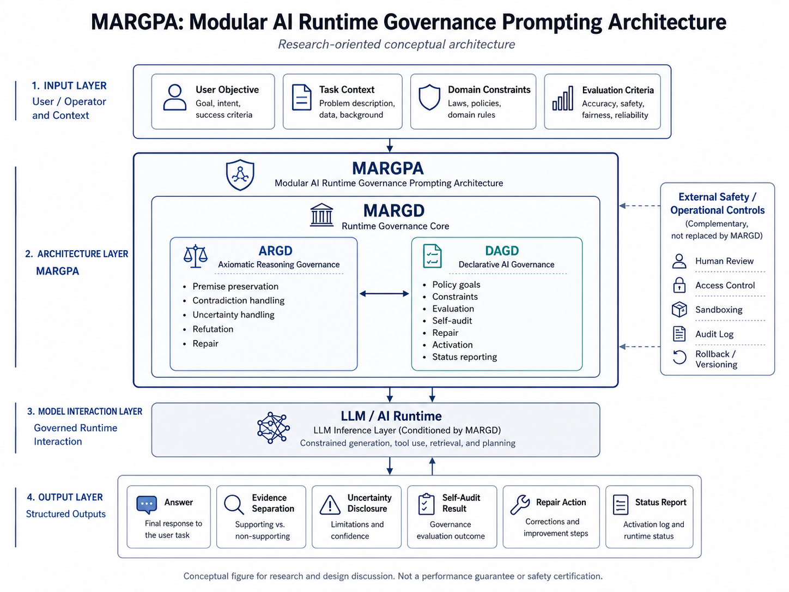

---

# Overview

---

## 1. The Problem This Project Addresses

When AI / LLMs are used for business, research, design, auditing, education, medical assistance, Agentic AI, and similar areas, simply asking them to “give a good answer” is often insufficient to maintain stable responses.

In particular, the following problems can occur.

* Premises shared early in the conversation may weaken during a long dialogue
* The model may react only to the user’s most recent input and fail to preserve the full context
* The model may make assertions despite insufficient information
* Direct evidence and inference may become mixed
* The model may over-follow the user’s hypotheses or wishes
* Multiple hypotheses or interpretations may collapse too early into a single conclusion
* Even when errors or premise deviations occur, repair and re-fixation may be insufficient
* It may be difficult to preserve an auditable record of what was judged and on what basis
* When handling long text, complex context, or multiple documents, roles and issues may become mixed

MARGPA / MARGD is a design for treating AI / LLM runtime instructions not as one-off prompts, but as externally supplied runtime governance specifications.



---

## 2. What MARGPA / MARGD Aims to Do

MARGPA, or Modular AI Runtime Governance Prompting Architecture, is a design framework for combining multiple governance definitions at the runtime instruction layer of AI / LLM systems.

The purpose of MARGPA is not to fully control AI / LLM responses.

Its purpose is to make the following behaviors easier to handle in contexts such as long-form work, precision tasks, research, design, auditing, RAG, and Agentic AI.

* Premise preservation
* Context preservation
* Scope management
* Evidence separation
* Uncertainty disclosure
* Refutation
* Preservation of multiple hypotheses
* Self-audit
* Repair
* Re-fixation
* Status reporting
* Improved auditability

MARGD, or Modular AI Runtime Governance Definition, is the upper-level category of runtime governance definitions used under MARGPA.

MARGD is not a single definition. It is a family name that may include ARGD, DAGD, and future additional definitions.

This repository publishes ARGD and DAGD as the main current components of the MARGD family.

---

## 3. What This Makes Possible

Applying MARGPA / MARGD does not improve the base capabilities of an AI / LLM itself.

However, for AI / LLMs with sufficient capability, explicitly specifying task-relevant premises, constraints, evaluation axes, repair conditions, and audit targets can make it easier to organize the response-generation search space.

Expected effects include the following.

* Making it easier to preserve initial conditions and decisions in long conversations
* Making it easier to disclose missing information instead of asserting conclusions under insufficient information
* Making it easier to separate direct evidence, inference, hypotheses, and unconfirmed information
* Making it harder to uncritically follow the user’s guidance or wishes
* Making it easier to preserve multiple interpretations or candidates
* Making it easier to move into repair and re-fixation when errors or drift occur
* Making it easier to structure outputs not only as explanations, but also as confirmation items, unconfirmed items, decision bases, and next actions
* Making it easier to report the current governance state and repair state during long research or design dialogues

These results are not guaranteed for every model.

Effects depend on the model’s instruction-following ability, context retention capability, reasoning capability, implementation environment, input format, task content, and clarity of user input.

---

## 4. Relationship Between MARGPA / MARGD / ARGD / DAGD

The main concepts in this repository are related as follows.

```text
MARGPA
= Modular AI Runtime Governance Prompting Architecture
= Upper-level design framework for combining multiple runtime governance definitions

MARGD
= Modular AI Runtime Governance Definition
= Upper-level category for governance definitions / syntax families used under MARGPA

ARGD
= Axiomatic Reasoning Governance Definition
= Runtime governance definition for governing reasoning procedures

DAGD
= Declarative AI Governance Definition
= Runtime governance definition for goals, constraints, evaluation, repair, auditing, activation, and status reporting
```

In simplified form, the relationship is as follows.

```text
MARGPA
└─ MARGD family
   ├─ ARGD
   └─ DAGD
```

MARGPA is the upper-level design framework, and MARGD is the family name for governance definitions used under it.

ARGD and DAGD are the main current components of the MARGD family published at this stage.

---

## 5. Role of ARGD

ARGD is a definition for governing AI / LLM reasoning procedures and the order of answer formation.

It mainly addresses the following areas.

* Input interpretation
* Context priority
* Definitions
* Premise fixation
* Conflict handling
* Handling of insufficient information
* Refutation
* Preservation of multiple hypothesis branches
* Answer structure
* Expression control
* Dialogue efficiency
* Self-repair

ARGD does not give the AI new knowledge or abilities.

The role of ARGD is to externally specify the order and rules by which already provided information and context should be handled, making it easier to suppress premise deviation, generalization drift, unsupported assertions, hypothesis collapse, and excessive sycophancy.

This repository contains the following ARGD files.

```text
definitions/
  argd_v0.3.0_en.json
  argd_v0.3.0_ja.json
  argd_v0.3.1_en.json
  argd_v0.3.1_ja.json
```

ARGD v0.3.0 and later are both foundation specifications for research, design, and validation.

ARGD v0.3.1 strengthens refutation, anti-sycophancy, alternative interpretations, and refutation-introduction control compared with v0.3.0.

Neither is a lightweight prompt for casual users. Both are treated as foundation specifications for precision work.

---

## 6. Role of DAGD

DAGD is a declarative definition for handling AI / LLM behavior policy, prohibited behaviors, required behaviors, evaluation, repair, activation, self-audit, audit-to-action handling, and status reporting.

It mainly addresses the following areas.

* policy goal
* constraints
* capabilities
* evaluation
* repair
* activation
* self_audit
* audit_to_action
* status_reporting

DAGD does not give the AI specific business knowledge or professional qualifications.

The role of DAGD is to externally declare what the AI / LLM should aim for, what it should avoid, what it should be required to do, how it should be evaluated, and how it should repair anomalies or failures during response generation.

This repository contains the following DAGD files.

```text
definitions/
  dagd_v0.4.4_en.json
  dagd_v0.4.4_ja.json
```

DAGD v0.4.4 emphasizes truthfulness, reasoning integrity, context preservation, premise preservation, auditability, and repairability. It handles evidence disclosure, traceability, uncertainty disclosure, self-audit, repair, re-binding, and status reporting.

---

## 7. Meaning of Using ARGD and DAGD Together

ARGD and DAGD do not have the same role.

Their roles can be separated as follows.

```text
ARGD:
How reasoning procedures and answer formation should be handled

DAGD:
What goals to pursue, what to prohibit, what to require, and how to evaluate and repair
```

ARGD is close to a procedural / how layer.

DAGD is close to a declarative / what layer.

When used together, DAGD defines goals, prohibitions, required behaviors, evaluation, repair, and status reporting, while ARGD supports the reasoning procedures, premise preservation, branching, refutation, and answer structure needed to handle them.

In simplified form:

```text
DAGD:
Defines what to preserve, what to avoid, what to evaluate, and how to repair

ARGD:
Supports how those definitions are interpreted, preserved, branched, and reflected in answers
```

This separation makes it possible to treat AI / LLM behavior not as one giant prompt, but as role-separated runtime governance definitions.

---

## 8. Difference From Ordinary Prompts

ARGD / DAGD are not ordinary prompts that simply ask the model to “do X.”

Ordinary prompts often request a specific output or task.

In contrast, ARGD / DAGD are runtime governance specifications for externally defining conditions such as the following during AI / LLM response generation.

* How to preserve premises
* What to treat as unconfirmed information
* How to separate evidence and inference
* How to preserve multiple hypotheses
* When to avoid assertions
* How to perform self-audit
* How to repair errors or drift when detected
* When to report state

Therefore, ARGD / DAGD should be treated not as simple request text, but as external specifications for structuring observable behavior during AI / LLM response generation.

---

## 9. Difference From Guardrails

ARGD / DAGD are not intended only for simple input-output filtering.

Typical guardrails are often used to detect or restrict prohibited inputs, prohibited outputs, dangerous expressions, confidential information, or policy violations.

In contrast, ARGD / DAGD are external specifications for governing and auditing observable behavior during response generation, such as the following.

* Reasoning procedures
* Premise preservation
* Evidence disclosure
* Uncertainty disclosure
* Refutation
* Preservation of multiple hypotheses
* Output structure
* Self-audit
* Repair
* Re-fixation
* Status reporting

ARGD / DAGD do not directly inspect internal reasoning itself.

They also do not rewrite internal reasoning.

They are specifications supplied externally at runtime to make observable response structure, evidence management, uncertainty handling, and repair behavior easier to handle.

---

## 10. Intended Areas of Use

MARGPA / MARGD is not a lightweight prompt optimized for every conversation.

It is especially suited to situations where premise preservation, evidence management, uncertainty disclosure, auditing, and repair are important.

Intended areas of use include the following.

* Research discussion
* Specification design
* Design review
* Code review
* RAG / internal knowledge AI
* Customer support assistance
* Assistance for legal, policy, and audit documents
* Information organization for medical assistive AI
* Education AI / learning support AI
* Purpose, authority, and execution-condition management for Agentic AI
* Continuous work using long dialogue logs
* High-precision document creation, comparison, and validation work

On the other hand, it can be excessive for uses such as the following.

* Casual conversation
* Light questions
* Short text generation
* Creative writing where constraints should be loose
* Rough ideation
* Consultations that do not require strict premise preservation
* Situations where broad AI-side completion or free ideation is prioritized

MARGPA / MARGD is not a syntax for maximizing free completion.

It is a syntax that narrows the search space to some extent and prioritizes precision, premise preservation, auditability, and repairability.

---

## 11. What This Project Does Not Claim

This project does not claim to do any of the following.

* Modify model weights
* Modify training data
* Override built-in system policies
* Bypass safety layers or guardrails
* Perform jailbreaks
* Improve the base capabilities of LLMs themselves
* Guarantee the same effect across all LLMs
* Be effective for all tasks
* Guarantee correctness or safety
* Guarantee compliance with laws, standards, or internal regulations
* Provide a standalone production-ready safety layer
* Replace expert judgment

ARGD / DAGD are inference-time external governance specifications.

In other words, they are governance specifications supplied externally at inference time, and they do not change the model’s own capabilities, knowledge, weights, training data, or built-in safety mechanisms.

---

## 12. Current Limitations

ARGD / DAGD are currently experimental foundation specifications.

They are not finished products already optimized for specific domains.

Practical application requires adding the following for each target domain.

* Business requirements
* Risk assessment
* Evaluation axes
* Evidence-disclosure requirements
* Human confirmation conditions
* Authority management
* Audit logs
* External safety mechanisms
* Expert review
* Compliance checks against laws, policies, and safety standards

MARGPA / MARGD also assumes use with AI / LLMs that have sufficient context retention, long-instruction following, compression and re-expansion ability, and reasoning capability.

For lightweight models, fast-response-oriented models, short-answer-oriented models, or models with weak long-context retention, specification retention, application, re-fixation, auditing, and repair may become unstable.

In addition, because the specifications are long, token costs increase.

For lightweight uses, it may be more appropriate to design shortened versions or domain-specific versions derived for the use case.

---

## 13. Next Documents to Read

This repository assumes the following reading order.

```text
README.md
First entry point. A short description of the overall project.

docs/overview_en.md
This document. Overall view of MARGPA / MARGD / ARGD / DAGD.

docs/argd_and_dagd_en.md
Technical overview of ARGD / DAGD. Main structure, role separation, and meaning of combined use.

docs/quickstart_en.md
Minimal procedure for practical use.

docs/usage_and_limitations_en.md
Usage principles, suitable uses, unsuitable uses, constraints, and non-guarantees.

docs/validation_and_operation_observation_en.md
Small-scale validation and operation observation. Summary of behaviors observed in 3-turn validation and long-dialogue logs.

docs/use_cases_en.md
Entry point for possible applications.

docs/use_cases/
Details on medical assistive AI, education AI, Agentic AI, and common behavior patterns.
```

The ARGD / DAGD definition files are placed under the following directory.

```text
definitions/
  argd_v0.3.0_en.json
  argd_v0.3.0_ja.json
  argd_v0.3.1_en.json
  argd_v0.3.1_ja.json
  dagd_v0.4.4_en.json
  dagd_v0.4.4_ja.json
  argd_v0.3.0_en_dagd_v0.4.4_en.json
  argd_v0.3.0_ja_dagd_v0.4.4_ja.json
  argd_v0.3.1_en_dagd_v0.4.4_en.json
  argd_v0.3.1_ja_dagd_v0.4.4_ja.json
```

---

This repository does not present MARGPA / MARGD as a completed universal theory.

At this stage, it is published as an experimental runtime governance foundation for handling precision work, long-context use, premise preservation, auditing, and repair in AI / LLM systems.

---
