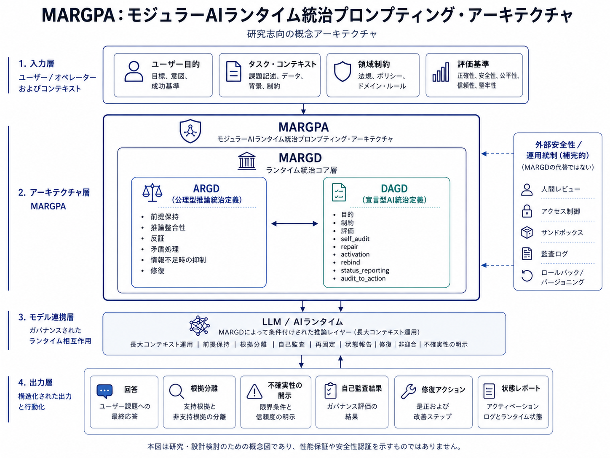

---

# 概要

---

## 1. このプロジェクトが扱う問題

AI / LLM を業務、研究、設計、監査、教育、医療補助、Agentic AI などに用いる場合、単に「よい回答をしてください」と依頼するだけでは、応答の安定性を維持しにくい場面がある。

特に、次のような問題が起こり得る。

- 初期に共有した前提が、長い対話の途中で薄れる
- ユーザーの直近入力だけに反応し、文脈全体が保持されない
- 情報不足のまま断定する
- 直接根拠と推論が混ざる
- ユーザーの仮説や希望に過度に追従する
- 複数の仮説や解釈が、単一結論へ早期に潰れる
- 誤りや前提逸脱が起きても、修復や再固定が不十分になる
- 監査可能な形で、何を根拠に何を判断したかが残りにくい
- 長文・複雑文脈・複数文書を扱うと、役割や論点が混線しやすい

MARGPA / MARGD は、このような問題に対して、AI / LLM の実行時指示を単発の依頼文ではなく、外部から与える runtime governance specification として扱うための設計である。



---

## 2. MARGPA / MARGD が目指すこと

MARGPA（Modular AI Runtime Governance Prompting Architecture）は、AI / LLM の実行時指示層に対して、複数の統治定義を組み合わせて扱うための設計枠組みである。

MARGPA の目的は、AI / LLM の応答を完全に制御することではない。

目的は、長文・精密作業・研究・設計・監査・RAG・Agentic AI などの場面で、次のような挙動を扱いやすくすることである。

- 前提保持
- 文脈保持
- スコープ管理
- 根拠分離
- 不確実性の開示
- 反証
- 複数仮説の保持
- 自己監査
- 修復
- 再固定
- 状態報告
- 監査可能性の向上

MARGD（Modular AI Runtime Governance Definition）は、MARGPA 配下で使われる runtime governance definition の上位カテゴリである。

MARGD は単一の定義ではなく、ARGD、DAGD、将来的な追加定義を含み得る family 名である。

本リポジトリでは、MARGD family の主要構成例として、ARGD と DAGD を公開する。

---

## 3. 何ができるようになるか

MARGPA / MARGD を適用すると、AI / LLM の基礎能力そのものが向上するわけではない。

一方で、十分な能力を持つ AI / LLM に対して、タスク上重要な前提、制約、評価軸、修復条件、監査対象を明示することで、応答生成時の探索空間を整理しやすくなる。

想定される効果は、次のようなものだ。

- 長い対話で、初期条件や決定事項を保持しやすくする
- 情報不足時に、断定ではなく不足情報を明示しやすくする
- 直接根拠、推論、仮説、未確認情報を分けやすくする
- ユーザーの誘導や希望に、無批判に追従しにくくする
- 複数の解釈や候補を保持しやすくする
- 誤りやドリフトが発生した場合に、修復と再固定へ移行しやすくする
- 出力を、説明文だけでなく、確認事項、未確認事項、判断根拠、次の行動へ構造化しやすくする
- 長大な研究・設計対話で、現在の統治状態や修復状態を報告しやすくする

これらは、特定モデルで常に保証される結果ではない。

効果は、モデルの指示追従能力、コンテキスト保持力、推論力、実装環境、投入形式、タスク内容、ユーザー入力の明確さに依存する。

---

## 4. MARGPA / MARGD / ARGD / DAGD の関係

本リポジトリで扱う主要概念の関係は次の通りである。

```text
MARGPA
= Modular AI Runtime Governance Prompting Architecture
= モジュール型AIランタイム統治プロンプト設計
= 複数の runtime governance definition を組み合わせるための上位設計枠組み

MARGD
= Modular AI Runtime Governance Definition
= モジュール型AIランタイム統治定義
= MARGPA 配下で使われる統治定義群 / 構文群の上位カテゴリ

ARGD
= Axiomatic Reasoning Governance Definition
= 公理型推論統治定義
= 推論手続を統治する runtime governance definition

DAGD
= Declarative AI Governance Definition
= 宣言型AI統治定義
= 目的、制約、評価、修復、監査、活性化、状態報告を扱う runtime governance definition
````

関係を簡略化すると、次のようになる。

```text
MARGPA
└─ MARGD family
   ├─ ARGD
   └─ DAGD
```

MARGPA は上位の設計枠組みであり、MARGD はその配下で使われる統治定義の family 名である。

ARGD と DAGD は、現時点で公開する MARGD family の主要構成例である。

---

## 5. ARGD の役割

ARGD は、AI / LLM の推論手続や回答形成の順序を統治するための定義である。

主に次のような領域を扱う。

* 入力解釈
* 文脈優先順位
* 定義
* 前提固定
* 矛盾処理
* 情報不足処理
* 反証
* 複数仮説の分岐保持
* 回答構造
* 表現制御
* 対話効率
* 自己修復

ARGD は、AI に新しい知識や能力を与えるものではない。

ARGD の役割は、既に与えられた情報や文脈を、どの順序と規則で扱うかを外部から指定し、前提逸脱、一般論化、無根拠断定、仮説崩壊、過度な迎合を抑えやすくすることである。

本リポジトリでは、以下の ARGD を置く。

```text
definitions/
  argd_v0.3.0_en.json
  argd_v0.3.0_ja.json
  argd_v0.3.1_en.json
  argd_v0.3.1_ja.json
```

ARGD v0.3.0 以上は、どちらも研究・設計・検証向けの基盤仕様である。

ARGD v0.3.1 は、v0.3.0 に対して、反証、非迎合、代替解釈、反証導入文制御を強めた版である。

どちらもライトユーザー向けの軽量Promptではなく、精密作業向けの基盤仕様として扱う。

---

## 6. DAGD の役割

DAGD は、AI / LLM の挙動方針、禁止挙動、要求挙動、評価、修復、活性化、自己監査、監査結果から行動への対応、状態報告を扱うための宣言型定義である。

主に次のような領域を扱う。

* policy goal
* constraints
* capabilities
* evaluation
* repair
* activation
* self_audit
* audit_to_action
* status_reporting

DAGD は、AI に特定の業務知識や専門資格を与えるものではない。

DAGD の役割は、AI / LLM の応答生成時に、何を目標とし、何を禁じ、何を要求し、どのように評価し、異常や失敗時にどう修復するかを外部から宣言することである。

本リポジトリでは、以下の DAGD を置く。

```text
definitions/
  dagd_v0.4.4_en.json
  dagd_v0.4.4_ja.json
```

DAGD v0.4.4 は、truthfulness、reasoning integrity、context preservation、premise preservation、auditability、repairability を重視し、根拠提示、トレーサビリティ、不確実性開示、自己監査、修復、再拘束、状態報告を扱う。

---

## 7. ARGD と DAGD を併用する意味

ARGD と DAGD は、同じ役割を持つ定義ではない。

役割を分けると次のようになる。

```text
ARGD:
どのような推論手続・回答形成で扱うか

DAGD:
何を目標とし、何を禁じ、何を要求し、どう評価・修復するか
```

ARGD は procedural / how layer に近い。

DAGD は declarative / what layer に近い。

併用する場合、DAGD が目的、禁止事項、要求挙動、評価、修復、状態報告を定義し、ARGD がそれらを扱うための推論手続、前提保持、分岐、反証、回答構造を支える。

簡略化すると、次のようになる。

```text
DAGD:
何を守るか、何を避けるか、何を評価するか、どう修復するかを定義する

ARGD:
それらを、どのように解釈し、保持し、分岐し、回答へ反映するかを支える
```

この分離により、AI / LLM の挙動を単一の巨大Promptで扱うのではなく、役割の異なる runtime governance definition として整理できる。

---

## 8. 一般的なプロンプトとの違い

ARGD / DAGD は、単に「〜してください」と依頼する通常のプロンプトではない。

通常のプロンプトは、特定の出力や作業を依頼することが多い。

一方で、ARGD / DAGD は、AI / LLM の応答生成時に、次のような条件を外部から定義するための runtime governance specification である。

* 前提をどう保持するか
* 何を未確認情報として扱うか
* どのように根拠と推論を分けるか
* どのように複数仮説を保持するか
* いつ断定を避けるか
* どのように自己監査するか
* 誤りやドリフトを検出した場合にどう修復するか
* いつ状態報告するか

したがって、ARGD / DAGD は単なる依頼文ではなく、AI / LLM の応答生成時の観測可能な振る舞いを構造化するための外部仕様として扱う。

---

## 9. ガードレールとの違い

ARGD / DAGD は、入出力の単純なフィルタリングだけを目的とするものではない。

一般的なガードレールは、禁止入力や禁止出力、危険表現、機密情報、ポリシー違反などを検出・制限する仕組みとして使われることが多い。

一方で、ARGD / DAGD は、次のような応答生成時の観測可能な挙動を統治・監査するための外部仕様である。

* 推論手続
* 前提保持
* 根拠提示
* 不確実性開示
* 反証
* 複数仮説保持
* 出力構造
* 自己監査
* 修復
* 再固定
* 状態報告

ARGD / DAGD は、内部推論そのものを直接覗くものではない。

また、内部推論を書き換えるものでもない。

あくまで、実行時に外部から与える仕様により、出力として観測可能な応答構造、根拠管理、不確実性処理、修復挙動を扱いやすくするものである。

---

## 10. 想定される利用領域

MARGPA / MARGD は、すべての会話に最適化された軽量Promptではない。

特に向いているのは、前提保持、根拠管理、不確実性開示、監査、修復が重要な場面である。

想定される利用領域は次の通りである。

* 研究議論
* 仕様設計
* 設計レビュー
* コードレビュー
* RAG / 社内ナレッジAI
* カスタマーサポート支援
* 法務・規程・監査文書の補助
* 医療補助AIの情報整理
* 教育AI・学習支援AI
* Agentic AI の目的・権限・実行条件管理
* 長大な対話ログを使った継続作業
* 高精度な文書作成・比較・検証作業

一方で、次のような用途では過剰になりやすい。

* 雑談
* 軽い質問
* 短い文章生成
* 制約を緩めたい創作
* 大まかなアイデア出し
* 厳密な前提保持を必要としない相談
* AI側の自由補完や広い発想を優先したい場面

MARGPA / MARGD は、自由補完を最大化する構文ではない。

探索空間をある程度狭め、精密性、前提保持、監査性、修復性を優先する構文である。

---

## 11. 本プロジェクトが主張しないこと

本プロジェクトは、以下を主張しない。

* モデル重みを変更する
* 学習データを変更する
* 組み込みシステムポリシーを上書きする
* 安全層やガードレールを回避する
* jailbreak を行う
* LLM の基礎性能そのものを向上させる
* すべての LLM で同じ効果を保証する
* すべてのタスクで有効である
* 正確性や安全性を保証する
* 法令・規格・社内規程への適合を保証する
* 本番運用可能な安全層を単独で提供する
* 専門家判断を代替する

ARGD / DAGD は、inference-time external governance specification である。

つまり、推論時に外部から与える統治仕様であり、モデルそのものの能力、知識、重み、訓練データ、組み込み安全機構を変更するものではない。

---

## 12. 現時点の制約

ARGD / DAGD は、現時点では実験的な基盤仕様である。

特定ドメインに最適化済みの完成品ではない。

実務適用する場合は、対象ドメインごとに以下を追加する必要がある。

* 業務要件
* リスク評価
* 評価軸
* 根拠提示要件
* 人間確認条件
* 権限管理
* 監査ログ
* 外部安全機構
* 専門家レビュー
* 法令・規約・安全基準への適合確認

また、MARGPA / MARGD は、十分なコンテキスト保持力、長文指示追従能力、圧縮・再展開能力、推論力を持つ AI / LLM での利用を前提とする。

軽量モデル、高速応答向けモデル、短文応答向けモデル、長文コンテキスト保持が弱いモデルでは、仕様の保持、適用、再固定、監査、修復が不安定になる可能性がある。

さらに、仕様が長いため、トークンコストが増える。

軽量用途では、用途別に派生した短縮版やドメイン特化版を設計する方が適している。

---

## 13. 次に読む文書

本リポジトリでは、以下の順で読むことを想定している。

```text
README.md
最初の入口。プロジェクト全体の短い説明。

docs/overview_ja.md
本資料。MARGPA / MARGD / ARGD / DAGD の全体像。

docs/argd_and_dagd_ja.md
ARGD / DAGD の技術概要。主要構造、役割分担、併用時の意味。

docs/quickstart_ja.md
実際に使う場合の最小手順。

docs/usage_and_limitations_ja.md
利用原則、向いている用途、向いていない用途、制約、非保証事項。

docs/validation_and_operation_observation_ja.md
小規模検証と運用観察。3ターン検証と長大対話ログで観察された挙動の整理。

docs/use_cases_ja.md
応用可能性の入口。

docs/use_cases/
医療補助AI、教育AI、Agentic AI、共通挙動パターンの詳細。
```

ARGD / DAGD の定義本体は、以下に置く。

```text
definitions/
  argd_v0.3.0_en.json
  argd_v0.3.0_ja.json
  argd_v0.3.1_en.json
  argd_v0.3.1_ja.json
  dagd_v0.4.4_en.json
  dagd_v0.4.4_ja.json
  argd_v0.3.0_en_dagd_v0.4.4_en.json
  argd_v0.3.0_ja_dagd_v0.4.4_ja.json
  argd_v0.3.1_en_dagd_v0.4.4_en.json
  argd_v0.3.1_ja_dagd_v0.4.4_ja.json
```

---
本リポジトリは、MARGPA / MARGD を完成済みの万能理論として提示するものではない。

現時点では、AI / LLM の精密作業、長大文脈、前提保持、監査、修復を扱うための実験的な runtime governance foundation として公開する。

---
