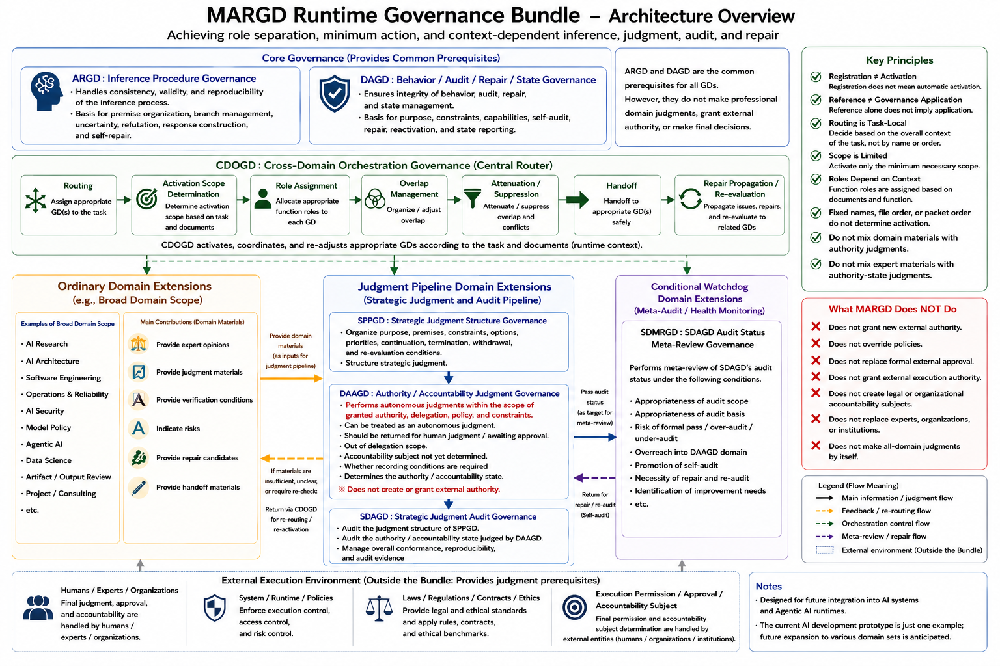

# Overview

This directory contains a prototype version of the MARGD Runtime Governance Bundle.

This prototype assumes ARGD / DAGD as prerequisites and is a runtime governance bundle for handling CDOGD and multiple Governance Definitions together.  
The current content is an initial domain set oriented toward AI development, judgment, audit, research, operations, and policy-related areas, and is positioned as an AI development prototype base.

However, this structure itself is not dedicated only to AI development. The bundle frame, CDOGD, and domain GD common skeleton template are designed with the future addition of domain sets from other fields in mind.

Details about each domain GD and related components are described below.

---

## 0. In Short, What Is This?

The MARGD Runtime Governance Bundle Prototype is a prototype runtime governance layer for making AI or LLMs handle multiple judgment perspectives, specialized domains, audits, and judgment of decision authority state together.

This is not merely a prompt collection.
It is also not a knowledge collection for a specific field, an execution engine, an approval mechanism, or a policy itself.

What this prototype handles is the structure of which governance AI should refer to when responding to a request, which specialized perspectives to use, which judgment materials to separate, where to perform authority / accountability judgment, where to audit, and where to hand off to human judgment or another GD.

In complex requests to AI, the following kinds of elements tend to become mixed together.

```text
Things that tend to become mixed:
  specialized judgment materials
  structure of strategic judgment
  decision authority
  execution permissibility
  audit
  meta-review
  artifact composition
  operational state
  safety risks
  handoff to human judgment
```

MARGD does not force these into one huge instruction or one universal domain, but handles them by separating them into multiple GDs.  
CDOGD then dynamically organizes which GDs should be applied within which scope according to the current request or target.

For this reason, the MARGD Runtime Governance Bundle can be understood as the following kind of structure.

```text
MARGD Runtime Governance Bundle:
  bundles multiple GDs
  dynamically organizes the applicable target, scope, and role of the necessary GDs
  separates specialized judgment materials from decision authority
  separates judgment structure from audit
  separates ordinary specialized GDs from authority-related GDs
  organizes overlaps and handoffs between domains
  makes AI response, judgment, audit, and repair easier to handle within runtime
```

The important point is that MARGD does not grant new authority to AI.  
MARGD is a layer for organizing which governance should be applied within the scope of the existing runtime, policy, tool permissions, human approval, and accountable parties.

[](https://github.com/nazuna-2371/margpa/blob/main/margd_bundle_prototype/assets/images/margd_runtime_governance_bundle_architecture_overview_en.png)

---

## 1. What This Prototype Includes

This prototype mainly includes the following elements.

* populated bundle prototype
* template for bundle creation
* common skeleton template for domain GD creation
* CDOGD
* 15 registered domain extensions
* Docs

ARGD / DAGD are the core governance prerequisites for this prototype.  
For details on ARGD / DAGD, refer to the README at the repository root and existing materials.

---

## 2. The 16 Governance Definitions

The Governance Definitions mainly handled in this prototype are the following 16.

* CDOGD
* SPPGD
* DAAGD
* SDAGD
* SDMRGD
* DSGD
* ACRGD
* AAGD
* AISGD
* MPGD
* DCAGD
* PMOGD
* AIRGD
* AIAGD
* SEGD
* OMRGD

Among these, CDOGD is the GD that handles cross-domain orchestration.  
The remaining 15 are domain extensions that are registered in the bundle and may become routing targets of CDOGD.

ARGD / DAGD are important core governance, but within this prototype they are not counted among the 16 Governance Definitions.  
ARGD / DAGD are treated as parent-side governance that each GD assumes as a prerequisite.

---

## 3. Basic Information and Roles of the 16 GDs

This section organizes the basic information and broad roles of the 16 GDs handled in this prototype.

For detailed responsibilities, out-of-scope items, and boundary conditions, refer to `docs/governance_definitions_en.md`.

### 3.1 CDOGD

```text id="overview_cdogd"
abbreviation:
  CDOGD

formal name:
  Cross-Domain Orchestration Governance Definition

location:
  definitions/orchestration/cdogd_v0.1.0_en.json
```

CDOGD is an orchestration GD for automatic dynamic routing that brings multiple GDs together across domains.

It organizes which GDs should be applied within which scope according to the current request or target.  
It also handles overlaps, handoffs, suppression, attenuation, and repair propagation between GDs.

### 3.2 SPPGD

```text id="overview_sppgd"
abbreviation:
  SPPGD

formal name:
  Strategic Planning and Prioritization Governance Definition

location:
  definitions/domain_extensions/decision_pipelines/sppgd_v0.1.0_en.json
```

SPPGD is a GD that organizes the structure of strategic judgment.

It organizes objectives, premises, constraints, options, options not selected, priorities, allocation, order, continuation, stopping, withdrawal, deferral, reevaluation conditions, and related items.

### 3.3 DAAGD

```text id="overview_daagd"
abbreviation:
  DAAGD

formal name:
  Decision Authority and Accountability Governance Definition

location:
  definitions/domain_extensions/decision_pipelines/daagd_v0.1.0_en.json
```

DAAGD is an authority / accountability GD that judges decision authority state within MARGD.

Based on existing system policy, developer policy, runtime policy, tool permissions, external execution permissions, delegation conditions, approval conditions, and responsibility boundaries,  
DAAGD judges whether the relevant judgment can be treated as an autonomous judgment by AI or runtime, should be returned to human judgment, should be treated as pending approval, should be treated as outside the delegation scope, or should be treated as having an undetermined accountable party.

However, DAAGD does not newly generate authority that does not exist externally.  
DAAGD judges the authority / accountability state within MARGD within the scope of already existing policies, authority, delegation, approval conditions, and responsibility boundaries.

### 3.4 SDAGD

```text id="overview_sdagd"
abbreviation:
  SDAGD

formal name:
  Strategic Decision Audit Governance Definition

location:
  definitions/domain_extensions/decision_pipelines/sdagd_v0.1.0_en.json
```

SDAGD is a GD responsible for audits related to strategic judgment.

SDAGD audits the judgment structure organized by SPPGD and the authority / accountability state judged by DAAGD.

What SDAGD indicates is only an audit state.  
SDAGD does not create the strategic judgment itself, does not replace DAAGD, and does not judge autonomous judgment permissibility, pending approval state, inside/outside delegation scope, or accountable-party establishment state.

### 3.5 SDMRGD

```text id="overview_sdmrgd"
abbreviation:
  SDMRGD

formal name:
  Strategic Decision Meta-Review Governance Definition

location:
  definitions/domain_extensions/conditional_watchdogs/sdmrgd_v0.1.0_en.json
```

SDMRGD is a GD that meta-reviews the audit state of SDAGD.

It checks SDAGD’s audit scope, audit grounds, audit result classification, risk of formal passage, over-auditing, under-auditing, need for repair, and related items.  
Escalation in SDMRGD does not mean directly proceeding to an external final judgment or approval.  
Basically, it means returning to SDAGD-side self-audit, repair, re-audit, or condition checking on the upper runtime side.

### 3.6 DSGD

```text id="overview_dsgd"
abbreviation:
  DSGD

formal name:
  Data Science Governance Definition

location:
  definitions/domain_extensions/ordinary/dsgd_v0.1.0_en.json
```

DSGD is a GD that handles analytical purpose, target scope, data, structure, provenance, quality, hypotheses, methods, evaluation metrics, omissions, bias, statistical validity, and analytical claims from the perspective of data analysis.

It organizes not only the analysis result itself, but also the premises, data, methods, and evaluation conditions on which that analysis is based.

### 3.7 ACRGD

```text id="overview_acrgd"
abbreviation:
  ACRGD

formal name:
  Artifact Composition and Review Governance Definition

location:
  definitions/domain_extensions/ordinary/acrgd_v0.1.0_en.json
```

ACRGD is a GD that handles artifact composition, transformation, readability, format, placement, and claims of publication or submission readiness.

For text, materials, structured files, submissions, and similar artifacts, it organizes purpose, audience, structure, format, disclosure scope, revision history, and related items.

### 3.8 AAGD

```text id="overview_aagd"
abbreviation:
  AAGD

formal name:
  Agentic AI Governance Definition

location:
  definitions/domain_extensions/ordinary/aagd_v0.1.0_en.json
```

AAGD is a GD that handles the execution process of Agentic AI.

It organizes objectives, work scope, plans, procedures, tool calls, side effects, work state, handoff, memory, completion confirmation, and related items.  
AAGD confirming the execution process does not mean issuing execution permission.

### 3.9 AISGD

```text id="overview_aisgd"
abbreviation:
  AISGD

formal name:
  AI Security Governance Definition

location:
  definitions/domain_extensions/ordinary/aisgd_v0.1.0_en.json
```

AISGD is a GD that handles AI security risks that occur through AI.

It handles prompt injection, jailbreak attempts, instruction leakage, exposure of secrets, exposure of personal information, tool abuse, authority confusion, policy evasion, inter-agent attacks, and related items.

### 3.10 MPGD

```text id="overview_mpgd"
abbreviation:
  MPGD

formal name:
  Model Policy Governance Definition

location:
  definitions/domain_extensions/ordinary/mpgd_v0.1.0_en.json
```

MPGD is a GD that handles grounds, applicability scope, exceptions, and records for judgments related to model policy.

It organizes identification of policies and clauses, applicability, priority relationships, conflicts, exceptions, over-refusal, under-refusal, reevaluation, repair, judgment history, and related items.

### 3.11 DCAGD

```text id="overview_dcagd"
abbreviation:
  DCAGD

formal name:
  Development Consulting AI Governance Definition

location:
  definitions/domain_extensions/ordinary/dcagd_v0.1.0_en.json
```

DCAGD is a GD that handles AI-assisted development consultation.

It organizes requirements clarification, technology options, design policy, comparison of implementation policies, feasibility, difficulty, rough effort, development risks, maintainability, extensibility, and related items.

### 3.12 PMOGD

```text id="overview_pmogd"
abbreviation:
  PMOGD

formal name:
  Project Management and Orchestration Governance Definition

location:
  definitions/domain_extensions/ordinary/pmogd_v0.1.0_en.json
```

PMOGD is a GD that handles organization of project progress.

It organizes work items, assignees, deadlines, dependencies, blockers, handoffs, agreements, unresolved items, deliverability, cross-domain work state, and related items.

### 3.13 AIRGD

```text id="overview_airgd"
abbreviation:
  AIRGD

formal name:
  AI Research Governance Definition

location:
  definitions/domain_extensions/ordinary/airgd_v0.1.0_en.json
```

AIRGD is a GD that handles research claims, novelty, and the connection between evidence and claims in AI research.

It organizes research questions, prior work, novelty claims, hypotheses, falsification conditions, research design, evidence, execution history, separation between results and claims, limitations, reproducibility conditions, and related items.

### 3.14 AIAGD

```text id="overview_aiagd"
abbreviation:
  AIAGD

formal name:
  AI Architecture Governance Definition

location:
  definitions/domain_extensions/ordinary/aiagd_v0.1.0_en.json
```

AIAGD is a GD that handles AI system structure, component responsibilities, connections, information flows, boundary design, placement, structural claims, and runtime conformance claims.

It organizes system purpose, requirements, quality attributes, component responsibilities, connections, trust boundaries, structure of authority boundaries, placement of models, retrieval mechanisms, memory mechanisms, tools, agents, policy layers, evaluation layers, and related items.

### 3.15 SEGD

```text id="overview_segd"
abbreviation:
  SEGD

formal name:
  Software Engineering Governance Definition

location:
  definitions/domain_extensions/ordinary/segd_v0.1.0_en.json
```

SEGD is a GD that handles software engineering execution, verification, change management, artifact identification, repair, rollback, rerun, and implementation history.

It organizes requirements, acceptance conditions, specifications, correspondence between design and implementation, repository, branch, source code changes, configuration changes, dependency changes, verification results, build results, deployment readiness state, implementation judgment history, and related items.

### 3.16 OMRGD

```text id="overview_omrgd"
abbreviation:
  OMRGD

formal name:
  Operations, Maintenance, and Reliability Governance Definition

location:
  definitions/domain_extensions/ordinary/omrgd_v0.1.0_en.json
```

OMRGD is a GD that handles operational state, maintainability, recoverability, and reliability.

It organizes operational state, service health, monitoring targets, logs, metrics, alerts, incidents, failures, degradation, outages, runbooks, rollback procedures, recovery procedures, maintenance work, operational risks, change impact, recurrence prevention, continuous improvement items, and related items.

---

## 4. Broad Structure

The structure of this prototype can be organized as follows.

```text
ARGD / DAGD:
  core prerequisite for reasoning and behavior governance

CDOGD:
  orchestration GD that organizes activation, roles, and handoffs across multiple domains

registered domain extensions:
  GD group that handles judgment materials, confirmation conditions, structures, audits, and states for each specialized domain

bundle prototype:
  something that brings these together as one runtime governance bundle
```

CDOGD does not decide processing based only on domain names or fixed order.  
It organizes which GDs should be applied within which scope based on the task, target, necessary governance, registration information, grounds, applicable scope, and related items.

---

## 5. Decision Pipeline and Ordinary Domain Extensions

In this prototype, domain extensions are broadly divided as follows.

* decision pipeline domain extensions
* conditional watchdog domain extensions
* ordinary domain extensions

Decision pipeline domain extensions are a group of GDs related to strategic judgment, decision authority, and audit.

```text
SPPGD:
  organizes the structure of strategic judgment

DAAGD:
  judges decision authority state within MARGD
  judges whether it can be treated as autonomous judgment, should be returned to human judgment, is pending approval, is outside the delegation scope, or has an undetermined accountable party

SDAGD:
  audits the judgment structure of SPPGD and the authority / accountability state judged by DAAGD
  does not replace DAAGD
  does not judge autonomous judgment permissibility, pending approval state, inside/outside delegation scope, or accountable-party establishment state
```

Among conditional watchdog domain extensions, SDMRGD is placed as the GD that meta-reviews the audit state of SDAGD.

Ordinary domain extensions are a group of GDs that provide judgment materials and confirmation conditions from the perspectives of each specialized domain.  
Ordinary domain extensions do not judge execution permission, final decisions, autonomous judgment permissibility, pending approval state, inside/outside delegation scope, or accountable-party establishment state.  
Those are areas handled by DAAGD or by external runtime policy, humans, organizations, or authority holders.

---

## 6. What This Prototype Does Not Do

MARGD and each GD do not increase AI authority.  
They also do not change higher authority, system policy, developer policy, runtime policy, tool permissions, external execution permissions, human approval authority, or accountable parties.

They are structures for making it easier to dynamically organize which governance scope should be referred to and within what scope it should be applied inside a given runtime or dialogue layer.

For detailed usage notes and limitations, refer to `docs/usage_and_limitations_en.md`.

---

## 7. How to Read the Docs

When reading for the first time, the following order is recommended.

```text
1. overview_en.md
   Grasp the overall picture

2. architecture_en.md
   See the relationships among bundle, template, ARGD / DAGD, CDOGD, and domain extensions

3. routing_principles_en.md
   See the concept of dynamic routing by CDOGD

4. governance_definitions_en.md
   List the roles of the 16 GDs

5. future_applicability_en.md
   See possible applications beyond AI development

6. usage_and_limitations_en.md
   Confirm usage notes, limitations, and authority boundaries
```

The documents under `docs/` are currently provisional drafts.

These Docs are supplementary materials for the MARGD Runtime Governance Bundle Prototype and are not completed specifications.  
Content, terminology, explanation granularity, boundary expressions between GDs, routing explanations, authority explanations, audit explanations, and explanations for runtime integration may require further revision in the future.

The descriptions in each Doc do not strictly and fully expand all contents of the JSON definitions themselves.  
To confirm the accurate structure, it is necessary to check the JSON definitions, bundle structure, templates, and related materials together.

---

## 8. Placement

Main definition files are placed under `definitions/`.

```text
definitions/
  bundle_prototype/
    populated bundle prototype

  templates/
    bundle template
    domain GD common skeleton template

  orchestration/
    CDOGD

  domain_extensions/
    decision_pipelines/
    conditional_watchdogs/
    ordinary/
```

Docs are placed under `docs/`.  
Auxiliary materials such as images are placed under `assets/images/`.

---

## 9. Bundle Configuration Example

A configuration example is shown below.

```text
core_governance:
  argd
  dagd

orchestration_governance:
  cdogd

registered_domain_extensions:
  decision_pipeline_domain_extensions:
    sppgd
    daagd
    sdagd

  conditional_watchdog_domain_extensions:
    sdmrgd

  ordinary_domain_extensions:
    dsgd
    acrgd
    aagd
    aisgd
    mpgd
    dcagd
    pmogd
    airgd
    aiagd
    segd
    omrgd
```

Each GD must be placed in the correct location according to its nature.

---

## 10. License and Warranty

This prototype may be used, modified, and otherwise adapted freely as long as it follows the repository license, CC-BY-SA-4.0.  
For license details, refer to `LICENSE` and related materials at the repository root.

However, this prototype is provided without warranty.  
Users need to check the content under their own responsibility and, as necessary, follow experts, organizations, institutions, laws and regulations, runtime policy, and system policy.