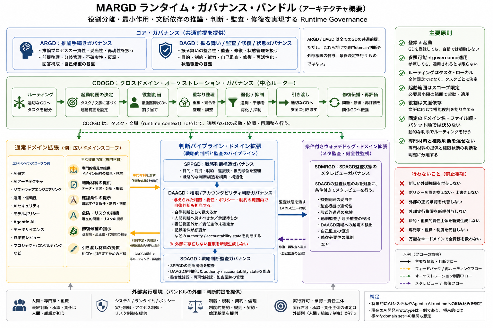

# 概要

このディレクトリには、MARGD Runtime Governance Bundle の試作版を配置している。

本prototypeは、ARGD / DAGD を前提とし、CDOGD と複数の Governance Definitions をまとめて扱うための runtime governance bundle である。  
現在の内容は AI開発・判断・監査・研究・運用・policy 系に寄せた初期domain setであり、AI development prototype base として位置づける。

ただし、この構造自体はAI開発専用ではない。bundle frame、CDOGD、domain GD common skeleton template は、将来的に別分野のdomain setを追加することも想定した構造である。

各domain GDなどについての詳細は後述とする。

---

## 0. 要するにこれは何か

MARGD Runtime Governance Bundle Prototype は、AIやLLMに対して、複数の判断観点、専門領域、監査、判断権限状態の判断をまとめて扱わせるための runtime governance layer の試作である。

これは、単なるプロンプト集ではない。
また、特定分野の知識集、実行エンジン、承認機構、policyそのものでもない。

このprototypeが扱うのは、AIがある依頼に応答するときに、どのgovernanceを参照し、どの専門観点を使い、どの判断材料を分け、どこで authority / accountability 判断を行い、どこで監査し、どこで人間判断や別GDへ引き渡すべきか、という構造である。

通常、AIへの複雑な依頼では、次のような要素が混ざりやすい。

```text
混ざりやすいもの:
  専門的な判断材料
  戦略判断の構造
  判断権限
  実行可否
  監査
  メタレビュー
  成果物の構成
  運用状態
  安全上の危険
  人間判断への引き渡し
```

MARGDは、これらを1つの巨大な指示や1つの万能domainに押し込むのではなく、複数のGDに分けて扱う。  
そして、CDOGDが現在の依頼や対象に応じて、どのGDをどの範囲で働かせるかを動的にまとめる。

このため、MARGD Runtime Governance Bundle は、次のような構造として理解できる。

```text
MARGD Runtime Governance Bundle:
  複数のGDを束ねる
  必要なGDの適用対象・範囲・役割を動的に整理する
  専門判断材料と判断権限を分ける
  判断構造と監査を分ける
  通常の専門GDとauthority系GDを分ける
  domain間の重なりや引き渡しを整理する
  AIの応答・判断・監査・修復をruntime内で扱いやすくする
```

重要なのは、MARGDがAIに新しい権限を与えるものではない、という点である。  
MARGDは、既存のruntime、policy、tool権限、人間承認、責任主体の範囲内で、どのgovernanceを働かせるべきかを整理するための層である。

[](https://github.com/nazuna-2371/margpa/blob/main/margd_bundle_prototype/assets/images/margd_runtime_governance_bundle_architecture_overview_ja.png)

---

## 1. このprototypeに含まれるもの

本prototypeには、主に以下の要素が含まれる。

* populated bundle prototype
* bundle作成用template
* domain GD作成用common skeleton template
* CDOGD
* 15個の registered domain extensions
* 各Docs

ARGD / DAGD は、このprototypeの前提となるcore governanceである。  
ARGD / DAGD の詳細は、このrepository root側のREADMEおよび既存資料を参照すること。

---

## 2. 16個のGovernance Definitions

このprototypeで主に扱う Governance Definitions は、次の16個である。

* CDOGD
* SPPGD
* DAAGD
* SDAGD
* SDMRGD
* DSGD
* ACRGD
* AAGD
* AISGD
* MPGD
* DCAGD
* PMOGD
* AIRGD
* AIAGD
* SEGD
* OMRGD

このうち、CDOGD は cross-domain orchestration を扱うGDである。  
残り15個は、bundleに登録され、CDOGDのrouting対象となりうるdomain extensionsである。

ARGD / DAGD は重要なcore governanceであるが、このprototype内では16個のGovernance Definitionsには数えない。  
ARGD / DAGD は、各GDが前提とする親側のgovernanceとして扱う。

---

## 3. 16個のGDの基本情報と役割

このprototypeで扱う16個のGDについて、基本情報と大まかな役割を整理する。

詳細な責務、扱わないもの、境界条件については、`docs/governance_definitions_ja.md` を参照すること。

### 3.1 CDOGD

```text id="overview_cdogd"
略称:
  CDOGD

正式名称:
  Cross-Domain Orchestration Governance Definition

配置先:
  definitions/orchestration/cdogd_v0.1.0_en.json
```

CDOGD は、複数のGDを横断してまとめるための自動動的ルーティングのオーケストラGDである。

現在の依頼や対象に応じて、どのGDをどの範囲で働かせるかを整理する。  
また、GD同士の重なり、引き渡し、抑制、弱化、修復の伝播を扱う。

### 3.2 SPPGD

```text id="overview_sppgd"
略称:
  SPPGD

正式名称:
  Strategic Planning and Prioritization Governance Definition

配置先:
  definitions/domain_extensions/decision_pipelines/sppgd_v0.1.0_en.json
```

SPPGD は、戦略判断の構造を整理するGDである。

目的、前提、制約、選択肢、選ばなかった選択肢、優先順位、配分、順序、継続、停止、撤退、保留、再評価条件などを整理する。

### 3.3 DAAGD

```text id="overview_daagd"
略称:
  DAAGD

正式名称:
  Decision Authority and Accountability Governance Definition

配置先:
  definitions/domain_extensions/decision_pipelines/daagd_v0.1.0_en.json
```

DAAGD は、MARGD内で判断権限状態を判断する authority / accountability GD である。

DAAGDは、既存のsystem policy、developer policy、runtime policy、tool権限、外部実行権限、委任条件、承認条件、責任分界に基づき、  
当該判断をAIまたはruntimeの自律判断として扱えるか、人間判断へ戻すべきか、承認待ちとして扱うべきか、委任範囲外として扱うべきか、責任主体未確定として扱うべきかを判断する。

ただし、DAAGDは外部に存在しない権限を新しく生成するものではない。  
DAAGDは、既に存在する方針、権限、委任、承認条件、責任分界の範囲内で、MARGD内の authority / accountability state を判断する。

### 3.4 SDAGD

```text id="overview_sdagd"
略称:
  SDAGD

正式名称:
  Strategic Decision Audit Governance Definition

配置先:
  definitions/domain_extensions/decision_pipelines/sdagd_v0.1.0_en.json
```

SDAGD は、戦略判断に関する監査を担当するGDである。

SDAGDは、SPPGDが整理した判断構造と、DAAGDが判断した authority / accountability state を監査する。

SDAGDが示すのは、あくまで監査上の状態である。  
SDAGDは、戦略判断そのものを作らず、DAAGDを代替せず、自律判断可否、承認待ち状態、委任範囲内外、責任主体成立状態を判断しない。

### 3.5 SDMRGD

```text id="overview_sdmrgd"
略称:
  SDMRGD

正式名称:
  Strategic Decision Meta-Review Governance Definition

配置先:
  definitions/domain_extensions/conditional_watchdogs/sdmrgd_v0.1.0_en.json
```

SDMRGD は、SDAGDの監査状態をメタレビューするGDである。

SDAGDの監査範囲、監査根拠、監査結果分類、形式的通過の危険、過剰監査、過少監査、修復の必要性などを確認する。  
SDMRGDにおけるエスカレーションは、外部の最終判断や承認へ直接進めることではない。  
基本的には、SDAGD側の自己監査、修復、再監査、または上位runtime側の条件確認へ戻すことである。

### 3.6 DSGD

```text id="overview_dsgd"
略称:
  DSGD

正式名称:
  Data Science Governance Definition

配置先:
  definitions/domain_extensions/ordinary/dsgd_v0.1.0_en.json
```

DSGD は、データ分析の観点から、分析目的、対象範囲、データ、構造、出所、品質、仮説、手法、評価指標、漏れ、偏り、統計的妥当性、分析主張を扱うGDである。

分析結果そのものだけでなく、その分析がどの前提、データ、手法、評価条件に基づいているかを整理する。

### 3.7 ACRGD

```text id="overview_acrgd"
略称:
  ACRGD

正式名称:
  Artifact Composition and Review Governance Definition

配置先:
  definitions/domain_extensions/ordinary/acrgd_v0.1.0_en.json
```

ACRGD は、成果物の構成、変換、読みやすさ、形式、配置、公開・提出可能性の主張を扱うGDである。

文章、資料、構造化ファイル、提出物などについて、目的、読者、構成、形式、開示範囲、改訂履歴などを整理する。

### 3.8 AAGD

```text id="overview_aagd"
略称:
  AAGD

正式名称:
  Agentic AI Governance Definition

配置先:
  definitions/domain_extensions/ordinary/aagd_v0.1.0_en.json
```

AAGD は、Agentic AIの実行過程を扱うGDである。

目的、作業範囲、計画、手順、tool呼び出し、副作用、作業状態、引き渡し、記憶、完了確認などを整理する。  
AAGDが実行過程を確認することは、実行許可を出すことではない。

### 3.9 AISGD

```text id="overview_aisgd"
略称:
  AISGD

正式名称:
  AI Security Governance Definition

配置先:
  definitions/domain_extensions/ordinary/aisgd_v0.1.0_en.json
```

AISGD は、AIを介して発生するAIセキュリティ上の危険を扱うGDである。

プロンプト注入、脱獄試行、指示漏えい、秘密情報の露出、個人情報の露出、tool悪用、権限混同、方針回避、agent間攻撃などを扱う。

### 3.10 MPGD

```text id="overview_mpgd"
略称:
  MPGD

正式名称:
  Model Policy Governance Definition

配置先:
  definitions/domain_extensions/ordinary/mpgd_v0.1.0_en.json
```

MPGD は、model policy上の判断について、根拠、適用範囲、例外、記録を扱うGDである。

方針や条項の識別、適用可否、優先関係、矛盾、例外、過剰拒否、過少拒否、再評価、修復、判断履歴などを整理する。

### 3.11 DCAGD

```text id="overview_dcagd"
略称:
  DCAGD

正式名称:
  Development Consulting AI Governance Definition

配置先:
  definitions/domain_extensions/ordinary/dcagd_v0.1.0_en.json
```

DCAGD は、AI支援型の開発相談を扱うGDである。

要件整理、技術選択肢、設計方針、実装方針比較、実現可能性、難易度、概算工数、開発上の危険、保守性、拡張性などを整理する。

### 3.12 PMOGD

```text id="overview_pmogd"
略称:
  PMOGD

正式名称:
  Project Management and Orchestration Governance Definition

配置先:
  definitions/domain_extensions/ordinary/pmogd_v0.1.0_en.json
```

PMOGD は、プロジェクト進行の整理を扱うGDである。

作業項目、担当、期限、依存関係、阻害要因、引き渡し、合意事項、未解決事項、納品可能性、domain横断の作業状態などを整理する。

### 3.13 AIRGD

```text id="overview_airgd"
略称:
  AIRGD

正式名称:
  AI Research Governance Definition

配置先:
  definitions/domain_extensions/ordinary/airgd_v0.1.0_en.json
```

AIRGD は、AI研究における研究主張、新規性、証拠と主張のつながりを扱うGDである。

研究課題、先行研究、新規性の主張、仮説、反証条件、研究設計、証拠、実行履歴、結果と主張の分離、限界、再現条件などを整理する。

### 3.14 AIAGD

```text id="overview_aiagd"
略称:
  AIAGD

正式名称:
  AI Architecture Governance Definition

配置先:
  definitions/domain_extensions/ordinary/aiagd_v0.1.0_en.json
```

AIAGD は、AIシステムの構造、構成要素の責務、接続関係、情報の流れ、境界設計、配置、構造上の主張、実行時の整合主張を扱うGDである。

システムの目的、要件、品質属性、構成要素の責務、接続関係、信頼境界、権限境界の構造、model・検索機構・記憶機構・tool・agent・policy層・評価層の配置などを整理する。

### 3.15 SEGD

```text id="overview_segd"
略称:
  SEGD

正式名称:
  Software Engineering Governance Definition

配置先:
  definitions/domain_extensions/ordinary/segd_v0.1.0_en.json
```

SEGD は、software engineeringの実行、検証、変更管理、成果物の識別、修復、巻き戻し、再実行、実装履歴を扱うGDである。

要件、受け入れ条件、仕様、設計と実装の対応、repository、branch、source codeの変更、設定変更、dependencyの変更、検証結果、build結果、deployment準備状態、実装判断の履歴などを整理する。

### 3.16 OMRGD

```text id="overview_omrgd"
略称:
  OMRGD

正式名称:
  Operations, Maintenance, and Reliability Governance Definition

配置先:
  definitions/domain_extensions/ordinary/omrgd_v0.1.0_en.json
```

OMRGD は、運用状態、保守性、復旧可能性、信頼性を扱うGDである。

運用状態、serviceの健全性、監視対象、log、指標、alert、incident、failure、degradation、outage、runbook、rollback手順、recovery手順、保守作業、運用上の危険、変更影響、再発防止、継続的改善項目などを整理する。

---

## 4. 大まかな構造

本prototypeの構造は、次のように整理できる。

```text
ARGD / DAGD:
  reasoning と behavior governance のcore prerequisite

CDOGD:
  複数domainの起動、役割、引き渡しをまとめるorchestration GD

registered domain extensions:
  各専門領域の判断材料、確認条件、構造、監査、状態を扱うGD群

bundle prototype:
  これらを1つのruntime governance bundleとしてまとめたもの
```

CDOGDは、domain名や固定順序だけで処理を決めるものではない。  
task、対象、必要なgovernance、登録情報、根拠、適用範囲などをもとに、どのGDをどの範囲で働かせるかをまとめる。

---

## 5. decision pipeline と ordinary domain extensions

本prototypeでは、domain extensionsを大きく以下のように分けている。

* decision pipeline domain extensions
* conditional watchdog domain extensions
* ordinary domain extensions

decision pipeline domain extensions は、戦略判断、判断権限、監査に関わるGD群である。

```text
SPPGD:
  戦略判断の構造を整理する

DAAGD:
  MARGD内で判断権限状態を判断する
  自律判断として扱えるか、人間判断へ戻すべきか、承認待ちか、委任範囲外か、責任主体未確定かを判断する

SDAGD:
  SPPGDの判断構造と、DAAGDが判断した authority / accountability state を監査する
  DAAGDを代替しない
  自律判断可否、承認待ち状態、委任範囲内外、責任主体成立状態を判断しない
```

conditional watchdog domain extensions には、SDAGDの監査状態をメタレビューする SDMRGD を置く。

ordinary domain extensions は、各専門領域の観点から判断材料や確認条件を出すGD群である。  
ordinary domain extensions は、実行許可、最終決定、自律判断可否、承認待ち状態、委任範囲内外、責任主体成立状態を判断しない。  
それらは DAAGD または外部のruntime policy、人間、組織、権限主体が扱う領域である。

---

## 6. このprototypeがしないこと

MARGDおよび各GDは、AIの権限を増やすものではない。  
上位権限、system policy、developer policy、runtime policy、tool権限、外部実行権限、人間の承認権限、責任主体を変更するものでもない。

これらは、与えられたruntimeまたは対話層の内部で、どのgovernance scopeを参照し、どの範囲で適用すべきかを動的に整理しやすくするための構造である。

詳細な利用上の注意と限界は、`docs/usage_and_limitations_ja.md` を参照すること。

---

## 7. Docsの読み方

初めて読む場合は、次の順で読むとよい。

```text
1. overview_ja.md
   全体像を把握する

2. architecture_ja.md
   bundle、template、ARGD / DAGD、CDOGD、domain extensionsの関係を見る

3. routing_principles_ja.md
   CDOGDによる動的routingの考え方を見る

4. governance_definitions_ja.md
   16個のGDの役割を一覧する

5. future_applicability_ja.md
   AI開発以外への応用可能性を見る

6. usage_and_limitations_ja.md
   利用上の注意、限界、権限境界を確認する
```

なお、`docs/` 以下の文書は、現時点では仮版・暫定版である。

これらのDocsは、MARGD Runtime Governance Bundle Prototype の補助資料であり、完成済み仕様書ではない。  
内容、語彙、説明粒度、GD間の境界表現、routing説明、authority説明、監査説明、runtime組み込み時の説明には、今後さらに修正が必要になる可能性がある。

各Docsの記述は、JSON定義本体の全内容を厳密に展開し切れているものではない。  
正確な構造を確認する場合は、各JSON定義、bundle構成、template などをあわせて確認する必要がある。

---

## 8. 配置

主な定義ファイルは `definitions/` 以下に置く。

```text
definitions/
  bundle_prototype/
    populated bundle prototype

  templates/
    bundle template
    domain GD common skeleton template

  orchestration/
    CDOGD

  domain_extensions/
    decision_pipelines/
    conditional_watchdogs/
    ordinary/
```

Docsは `docs/` 以下に置く。  
画像などの補助資料は `assets/images/` 以下に置く。

---

## 9. bundle構成例

以下に構成例を示す。

```text
core_governance:
  argd
  dagd

orchestration_governance:
  cdogd

registered_domain_extensions:
  decision_pipeline_domain_extensions:
    sppgd
    daagd
    sdagd

  conditional_watchdog_domain_extensions:
    sdmrgd

  ordinary_domain_extensions:
    dsgd
    acrgd
    aagd
    aisgd
    mpgd
    dcagd
    pmogd
    airgd
    aiagd
    segd
    omrgd
```

各GDはそれらの性質上、正しい箇所に設置する必要がある。

---

## 10. ライセンスと保証

本prototypeは、repositoryのライセンスであるCC-BY-SA-4.0に従う限り、自由に利用・改変などが可能である。  
ライセンスの詳細については、repository root側の`LICENSE`などを参照すること。

ただし、本prototypeは無保証で提供される。  
利用者は、自身の責任で内容を確認し、必要に応じて専門家、組織、制度、法規制、runtime policy、system policyに従う必要がある。